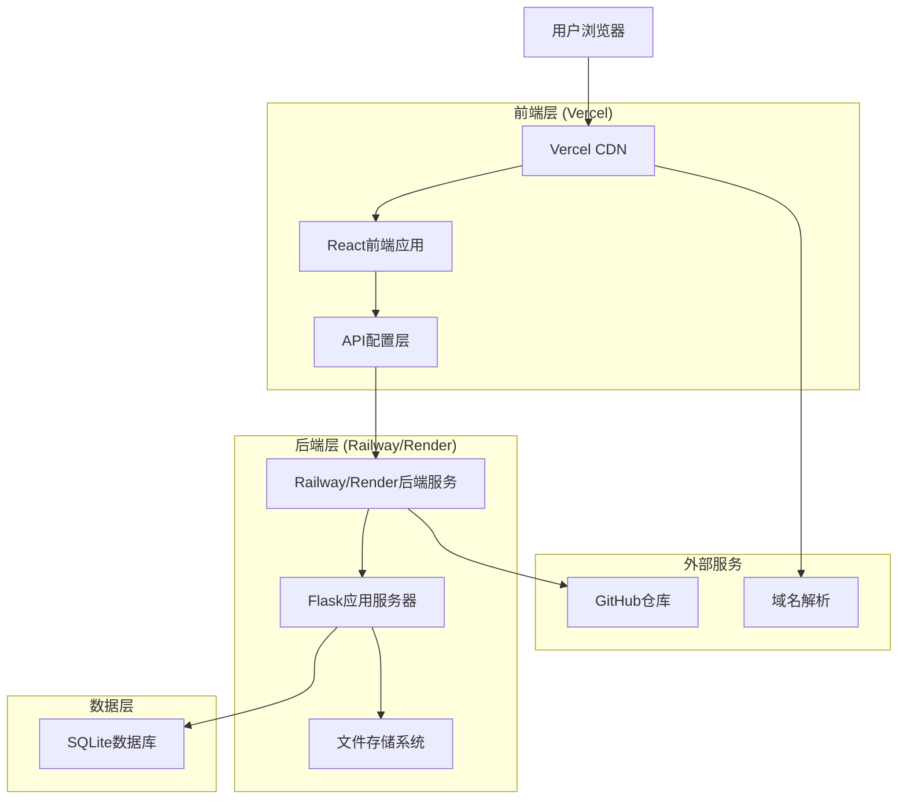
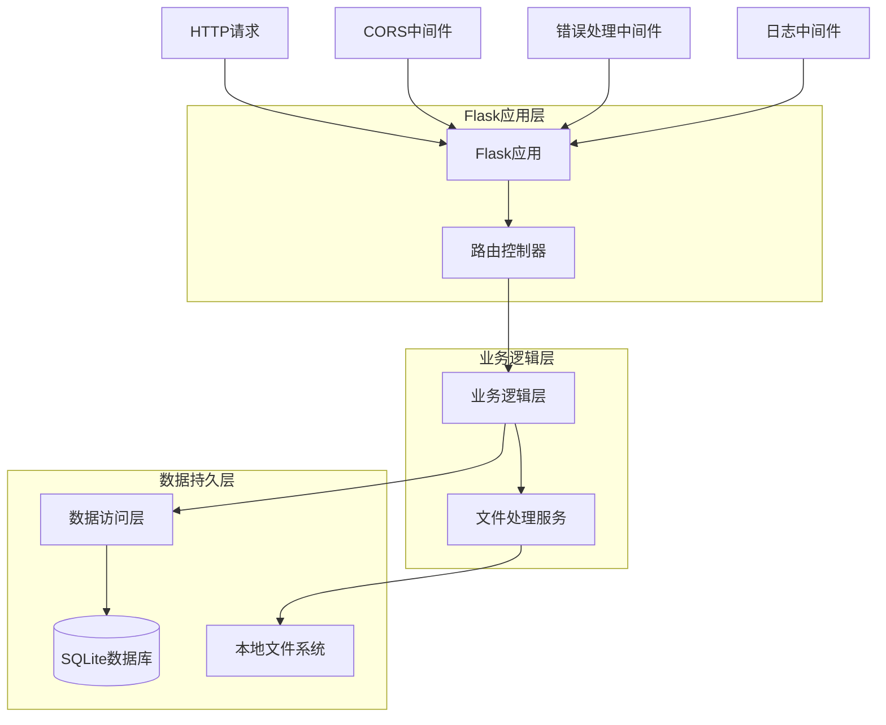
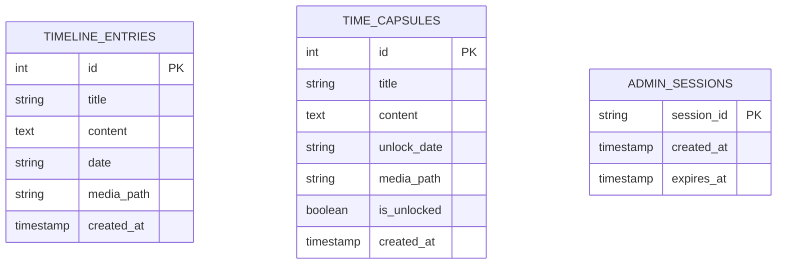
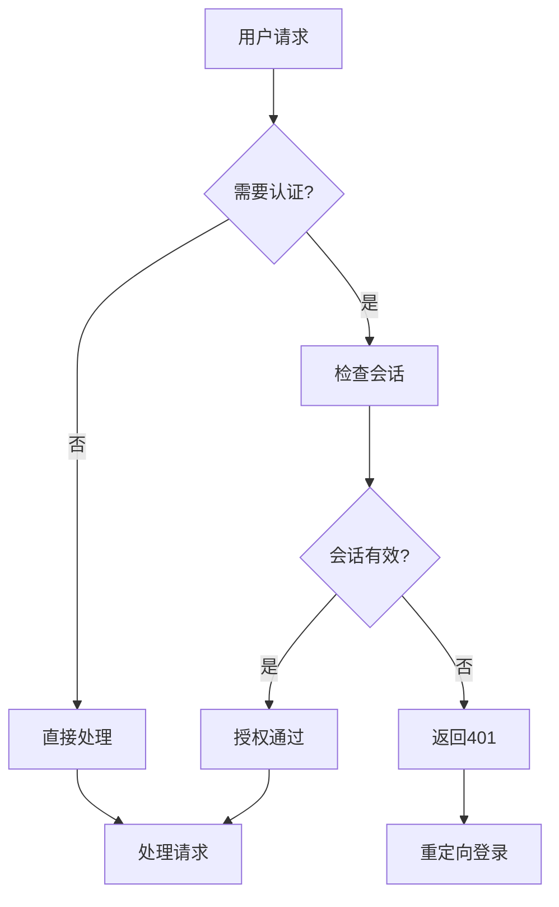

# 时光轴笔记本全栈部署技术架构文档

## 1. 架构设计



## 2. 技术描述

### 2.1 前端技术栈
- **框架**: Vue@3.3.4 + Vite@4.4.5
- **样式**: CSS3 + 响应式设计
- **构建工具**: Vite
- **部署平台**: Vercel
- **API通信**: Fetch API + 环境配置

### 2.2 后端技术栈
- **框架**: Flask@2.3.3
- **跨域处理**: Flask-CORS@4.0.0
- **图像处理**: Pillow@10.0.1
- **环境配置**: python-dotenv@1.0.0
- **部署平台**: Railway (主要) / Render (备选)

### 2.3 数据存储
- **数据库**: SQLite (文件数据库)
- **文件存储**: 本地文件系统
- **备份策略**: Git版本控制 + 定期备份

## 3. 路由定义

### 3.1 前端路由

| 路由 | 组件 | 功能描述 |
|------|------|----------|
| / | App.vue | 主应用容器，包含导航和路由出口 |
| /timeline | TimelineComponent.vue | 时间轴页面，显示时间线条目 |
| /capsules | TimeCapsuleList.vue | 时光胶囊页面，显示胶囊列表 |
| /admin | AdminPanel.vue | 管理员面板，内容管理功能 |

### 3.2 API路由配置

**开发环境**:
```javascript
baseURL: 'http://localhost:5000'
```

**生产环境**:
```javascript
baseURL: 'https://your-backend-domain.railway.app'
```

## 4. API定义

### 4.1 核心API接口

#### 健康检查
```
GET /api/health
```

响应:
| 参数名 | 参数类型 | 描述 |
|--------|----------|------|
| status | string | 服务状态 |
| timestamp | string | 响应时间戳 |

示例:
```json
{
  "status": "healthy",
  "timestamp": "2024-01-15T10:30:00Z"
}
```

#### 时间轴相关API

**获取时间轴条目**
```
GET /api/timeline
```

响应:
| 参数名 | 参数类型 | 描述 |
|--------|----------|------|
| entries | array | 时间轴条目列表 |
| total | number | 总条目数 |

**创建时间轴条目**
```
POST /api/timeline
```

请求:
| 参数名 | 参数类型 | 是否必需 | 描述 |
|--------|----------|----------|------|
| title | string | true | 条目标题 |
| content | string | true | 条目内容 |
| date | string | true | 日期 (YYYY-MM-DD) |
| media | file | false | 媒体文件 |

#### 时光胶囊相关API

**获取时光胶囊列表**
```
GET /api/capsules
```

**创建时光胶囊**
```
POST /api/capsules
```

请求:
| 参数名 | 参数类型 | 是否必需 | 描述 |
|--------|----------|----------|------|
| title | string | true | 胶囊标题 |
| content | string | true | 胶囊内容 |
| unlock_date | string | true | 解锁日期 |
| media | file | false | 媒体文件 |

#### 管理员相关API

**登录状态检查**
```
GET /api/login-status
```

**管理员登录**
```
POST /api/admin/login
```

请求:
| 参数名 | 参数类型 | 是否必需 | 描述 |
|--------|----------|----------|------|
| password | string | true | 管理员密码 |

**删除条目**
```
DELETE /api/admin/timeline/{id}
DELETE /api/admin/capsules/{id}
```

## 5. 服务器架构图



## 6. 数据模型

### 6.1 数据模型定义



### 6.2 数据定义语言

**时间轴条目表 (timeline_entries)**
```sql
-- 创建表
CREATE TABLE timeline_entries (
    id INTEGER PRIMARY KEY AUTOINCREMENT,
    title TEXT NOT NULL,
    content TEXT NOT NULL,
    date TEXT NOT NULL,
    media_path TEXT,
    created_at TIMESTAMP DEFAULT CURRENT_TIMESTAMP
);

-- 创建索引
CREATE INDEX idx_timeline_date ON timeline_entries(date DESC);
CREATE INDEX idx_timeline_created ON timeline_entries(created_at DESC);

-- 初始数据
INSERT INTO timeline_entries (title, content, date) VALUES
('项目启动', '时光轴笔记本项目正式开始开发', '2024-01-01'),
('功能完善', '完成基础的时间轴和时光胶囊功能', '2024-01-10');
```

**时光胶囊表 (time_capsules)**
```sql
-- 创建表
CREATE TABLE time_capsules (
    id INTEGER PRIMARY KEY AUTOINCREMENT,
    title TEXT NOT NULL,
    content TEXT NOT NULL,
    unlock_date TEXT NOT NULL,
    media_path TEXT,
    is_unlocked BOOLEAN DEFAULT FALSE,
    created_at TIMESTAMP DEFAULT CURRENT_TIMESTAMP
);

-- 创建索引
CREATE INDEX idx_capsules_unlock_date ON time_capsules(unlock_date);
CREATE INDEX idx_capsules_created ON time_capsules(created_at DESC);
CREATE INDEX idx_capsules_unlocked ON time_capsules(is_unlocked);

-- 初始数据
INSERT INTO time_capsules (title, content, unlock_date) VALUES
('新年愿望', '希望2024年项目能够成功上线', '2024-12-31'),
('学习计划', '完成Vue3和Flask的深入学习', '2024-06-30');
```

**管理员会话表 (admin_sessions)**
```sql
-- 创建表
CREATE TABLE admin_sessions (
    session_id TEXT PRIMARY KEY,
    created_at TIMESTAMP DEFAULT CURRENT_TIMESTAMP,
    expires_at TIMESTAMP NOT NULL
);

-- 创建索引
CREATE INDEX idx_sessions_expires ON admin_sessions(expires_at);
```

## 7. 部署配置

### 7.1 Railway部署配置

**railway.json**:
```json
{
  "build": {
    "builder": "NIXPACKS"
  },
  "deploy": {
    "startCommand": "python app.py",
    "restartPolicyType": "ON_FAILURE",
    "healthcheckPath": "/api/health",
    "healthcheckTimeout": 300
  }
}
```

**requirements.txt**:
```txt
Flask==2.3.3
Flask-CORS==4.0.0
Werkzeug==2.3.7
Pillow==10.0.1
python-dotenv==1.0.0
gunicorn==21.2.0
```

**Procfile**:
```
web: gunicorn --bind 0.0.0.0:$PORT app:app
```

### 7.2 Vercel部署配置

**vercel.json**:
```json
{
  "builds": [
    {
      "src": "frontend/package.json",
      "use": "@vercel/static-build",
      "config": {
        "distDir": "dist"
      }
    }
  ],
  "routes": [
    {
      "src": "/(.*)",
      "dest": "/index.html"
    }
  ]
}
```

### 7.3 环境变量配置

**后端环境变量 (Railway)**:
```env
PORT=5000
FLASK_ENV=production
FLASK_DEBUG=False
ADMIN_PASSWORD=your_secure_password
SECRET_KEY=your_secret_key
UPLOAD_FOLDER=uploads
MAX_CONTENT_LENGTH=16777216
```

**前端环境变量 (Vercel)**:
```env
VITE_API_BASE_URL=https://your-backend-domain.railway.app
VITE_APP_TITLE=时光轴笔记本
VITE_APP_VERSION=1.0.0
```

## 8. 监控和日志

### 8.1 应用监控

**健康检查端点**:
```python
@app.route('/api/health')
def health_check():
    return {
        'status': 'healthy',
        'timestamp': datetime.now().isoformat(),
        'version': '1.0.0',
        'database': check_database_connection(),
        'storage': check_storage_availability()
    }
```

**性能监控**:
- 响应时间监控
- 错误率统计
- 资源使用情况

### 8.2 日志配置

```python
import logging
from logging.handlers import RotatingFileHandler

# 配置日志
if not app.debug:
    file_handler = RotatingFileHandler('logs/app.log', maxBytes=10240, backupCount=10)
    file_handler.setFormatter(logging.Formatter(
        '%(asctime)s %(levelname)s: %(message)s [in %(pathname)s:%(lineno)d]'
    ))
    file_handler.setLevel(logging.INFO)
    app.logger.addHandler(file_handler)
    app.logger.setLevel(logging.INFO)
```

## 9. 安全架构

### 9.1 认证授权



### 9.2 数据安全

- **输入验证**: 所有用户输入进行严格验证
- **SQL注入防护**: 使用参数化查询
- **文件上传安全**: 限制文件类型和大小
- **XSS防护**: 输出内容进行转义
- **CSRF防护**: 使用CSRF令牌

### 9.3 传输安全

- **HTTPS强制**: 生产环境强制使用HTTPS
- **CORS配置**: 严格配置跨域访问
- **请求限制**: 实现API请求频率限制

## 10. 扩展性设计

### 10.1 水平扩展

- **负载均衡**: 支持多实例部署
- **数据库分离**: 可迁移到独立数据库服务
- **文件存储**: 可集成云存储服务
- **缓存层**: 可添加Redis缓存

### 10.2 功能扩展

- **用户系统**: 支持多用户注册登录
- **权限管理**: 细粒度权限控制
- **API版本**: 支持API版本管理
- **插件系统**: 支持功能插件扩展

---

通过以上技术架构设计，时光轴笔记本项目具备了完整的全栈部署能力，支持生产环境的稳定运行和未来的功能扩展。