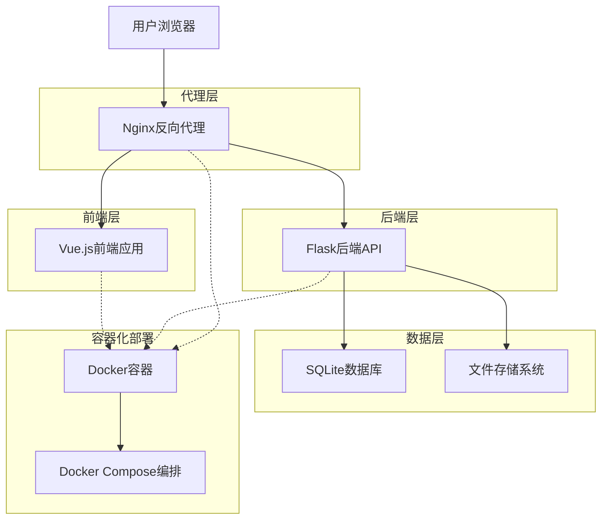
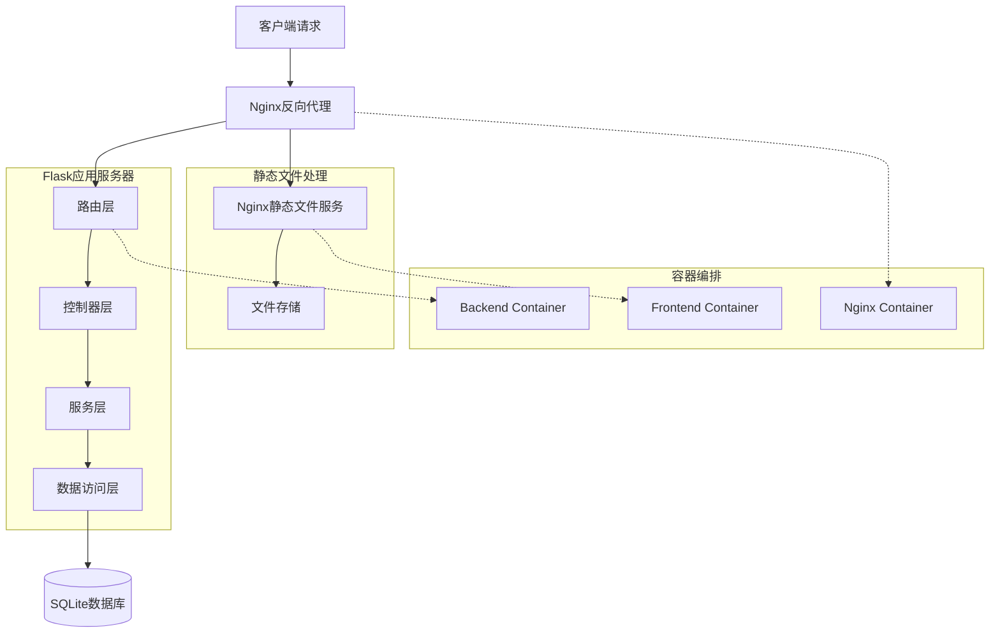
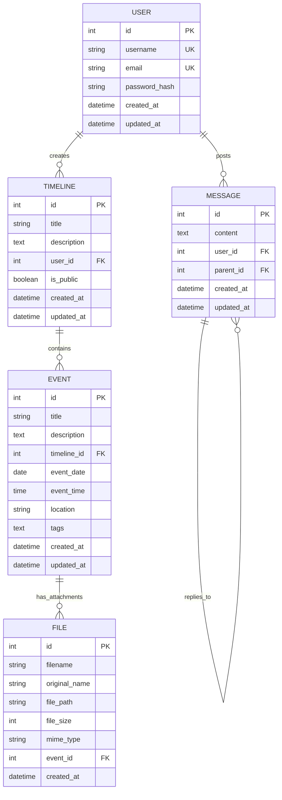

# 时光轴笔记项目 - 技术架构文档

## 1. Architecture design



## 2. Technology Description

* **前端**: Vue.js\@3 + Vue Router\@4 + Axios + Moment.js + FontAwesome + Vite

* **后端**: Flask\@3.0.3 + Flask-SQLAlchemy\@3.1.1 + Flask-CORS\@5.0.0 + Gunicorn\@23.0.0

* **数据库**: SQLite (生产环境可升级为PostgreSQL)

* **代理服务器**: Nginx (反向代理、静态文件服务、SSL终端)

* **容器化**: Docker + Docker Compose

* **部署**: 支持云服务器部署 (阿里云、腾讯云等)

## 3. Route definitions

| Route         | Purpose          |
| ------------- | ---------------- |
| /             | 首页，展示时间线列表和导航    |
| /timeline/:id | 时间线详情页，显示具体时间线内容 |
| /create       | 创建时间线页面          |
| /edit/:id     | 编辑时间线页面          |
| /login        | 用户登录页面           |
| /register     | 用户注册页面           |
| /profile      | 用户个人资料页面         |
| /messages     | 留言墙页面，用户互动交流     |
| /about        | 关于页面，项目介绍        |

## 4. API definitions

### 4.1 Core API

#### 用户认证相关

**用户注册**

```
POST /api/register
```

Request:

| Param Name | Param Type | isRequired | Description  |
| ---------- | ---------- | ---------- | ------------ |
| username   | string     | true       | 用户名 (3-20字符) |
| email      | string     | true       | 邮箱地址         |
| password   | string     | true       | 密码 (6-50字符)  |

Response:

| Param Name | Param Type | Description  |
| ---------- | ---------- | ------------ |
| success    | boolean    | 注册是否成功       |
| message    | string     | 响应消息         |
| user\_id   | integer    | 用户ID (成功时返回) |

**用户登录**

```
POST /api/login
```

Request:

| Param Name | Param Type | isRequired | Description |
| ---------- | ---------- | ---------- | ----------- |
| username   | string     | true       | 用户名或邮箱      |
| password   | string     | true       | 密码          |

Response:

| Param Name | Param Type | Description  |
| ---------- | ---------- | ------------ |
| success    | boolean    | 登录是否成功       |
| message    | string     | 响应消息         |
| user       | object     | 用户信息 (成功时返回) |

#### 时间线管理

**获取时间线列表**

```
GET /api/timelines
```

Query Parameters:

| Param Name | Param Type | isRequired | Description |
| ---------- | ---------- | ---------- | ----------- |
| page       | integer    | false      | 页码 (默认1)    |
| per\_page  | integer    | false      | 每页数量 (默认10) |
| user\_id   | integer    | false      | 用户ID筛选      |

Response:

| Param Name | Param Type | Description |
| ---------- | ---------- | ----------- |
| timelines  | array      | 时间线列表       |
| total      | integer    | 总数量         |
| page       | integer    | 当前页码        |
| per\_page  | integer    | 每页数量        |

**创建时间线**

```
POST /api/timelines
```

Request:

| Param Name  | Param Type | isRequired | Description   |
| ----------- | ---------- | ---------- | ------------- |
| title       | string     | true       | 时间线标题         |
| description | string     | false      | 时间线描述         |
| is\_public  | boolean    | false      | 是否公开 (默认true) |
| events      | array      | false      | 事件列表          |

**获取时间线详情**

```
GET /api/timelines/{id}
```

Response:

| Param Name  | Param Type | Description |
| ----------- | ---------- | ----------- |
| id          | integer    | 时间线ID       |
| title       | string     | 标题          |
| description | string     | 描述          |
| user\_id    | integer    | 创建者ID       |
| is\_public  | boolean    | 是否公开        |
| events      | array      | 事件列表        |
| created\_at | string     | 创建时间        |
| updated\_at | string     | 更新时间        |

#### 事件管理

**添加事件**

```
POST /api/timelines/{timeline_id}/events
```

Request:

| Param Name  | Param Type | isRequired | Description       |
| ----------- | ---------- | ---------- | ----------------- |
| title       | string     | true       | 事件标题              |
| description | string     | false      | 事件描述              |
| event\_date | string     | true       | 事件日期 (YYYY-MM-DD) |
| event\_time | string     | false      | 事件时间 (HH:MM)      |
| location    | string     | false      | 事件地点              |
| tags        | array      | false      | 标签列表              |

#### 文件上传

**上传文件**

```
POST /api/upload
```

Request (multipart/form-data):

| Param Name | Param Type | isRequired | Description           |
| ---------- | ---------- | ---------- | --------------------- |
| file       | file       | true       | 上传的文件                 |
| type       | string     | false      | 文件类型 (image/document) |

Response:

| Param Name | Param Type | Description |
| ---------- | ---------- | ----------- |
| success    | boolean    | 上传是否成功      |
| filename   | string     | 文件名         |
| url        | string     | 文件访问URL     |
| size       | integer    | 文件大小 (字节)   |

#### 留言墙

**获取留言列表**

```
GET /api/messages
```

**发布留言**

```
POST /api/messages
```

Request:

| Param Name | Param Type | isRequired | Description   |
| ---------- | ---------- | ---------- | ------------- |
| content    | string     | true       | 留言内容          |
| parent\_id | integer    | false      | 父留言ID (回复时使用) |

#### 健康检查

**系统健康检查**

```
GET /api/health
```

Response:

| Param Name  | Param Type | Description |
| ----------- | ---------- | ----------- |
| status      | string     | 系统状态        |
| message     | string     | 状态消息        |
| version     | string     | 应用版本        |
| environment | string     | 运行环境        |
| database    | string     | 数据库状态       |

Example:

```json
{
  "status": "healthy",
  "message": "Application is running normally",
  "version": "1.0.0",
  "environment": "production",
  "database": "connected"
}
```

## 5. Server architecture diagram



## 6. Data model

### 6.1 Data model definition



### 6.2 Data Definition Language

**用户表 (users)**

```sql
-- 创建用户表
CREATE TABLE users (
    id INTEGER PRIMARY KEY AUTOINCREMENT,
    username VARCHAR(50) UNIQUE NOT NULL,
    email VARCHAR(100) UNIQUE NOT NULL,
    password_hash VARCHAR(255) NOT NULL,
    created_at DATETIME DEFAULT CURRENT_TIMESTAMP,
    updated_at DATETIME DEFAULT CURRENT_TIMESTAMP
);

-- 创建索引
CREATE INDEX idx_users_username ON users(username);
CREATE INDEX idx_users_email ON users(email);
CREATE INDEX idx_users_created_at ON users(created_at DESC);
```

**时间线表 (timelines)**

```sql
-- 创建时间线表
CREATE TABLE timelines (
    id INTEGER PRIMARY KEY AUTOINCREMENT,
    title VARCHAR(200) NOT NULL,
    description TEXT,
    user_id INTEGER NOT NULL,
    is_public BOOLEAN DEFAULT 1,
    created_at DATETIME DEFAULT CURRENT_TIMESTAMP,
    updated_at DATETIME DEFAULT CURRENT_TIMESTAMP,
    FOREIGN KEY (user_id) REFERENCES users(id) ON DELETE CASCADE
);

-- 创建索引
CREATE INDEX idx_timelines_user_id ON timelines(user_id);
CREATE INDEX idx_timelines_is_public ON timelines(is_public);
CREATE INDEX idx_timelines_created_at ON timelines(created_at DESC);
```

**事件表 (events)**

```sql
-- 创建事件表
CREATE TABLE events (
    id INTEGER PRIMARY KEY AUTOINCREMENT,
    title VARCHAR(200) NOT NULL,
    description TEXT,
    timeline_id INTEGER NOT NULL,
    event_date DATE NOT NULL,
    event_time TIME,
    location VARCHAR(200),
    tags TEXT,
    created_at DATETIME DEFAULT CURRENT_TIMESTAMP,
    updated_at DATETIME DEFAULT CURRENT_TIMESTAMP,
    FOREIGN KEY (timeline_id) REFERENCES timelines(id) ON DELETE CASCADE
);

-- 创建索引
CREATE INDEX idx_events_timeline_id ON events(timeline_id);
CREATE INDEX idx_events_event_date ON events(event_date DESC);
CREATE INDEX idx_events_created_at ON events(created_at DESC);
```

**留言表 (messages)**

```sql
-- 创建留言表
CREATE TABLE messages (
    id INTEGER PRIMARY KEY AUTOINCREMENT,
    content TEXT NOT NULL,
    user_id INTEGER NOT NULL,
    parent_id INTEGER,
    created_at DATETIME DEFAULT CURRENT_TIMESTAMP,
    updated_at DATETIME DEFAULT CURRENT_TIMESTAMP,
    FOREIGN KEY (user_id) REFERENCES users(id) ON DELETE CASCADE,
    FOREIGN KEY (parent_id) REFERENCES messages(id) ON DELETE CASCADE
);

-- 创建索引
CREATE INDEX idx_messages_user_id ON messages(user_id);
CREATE INDEX idx_messages_parent_id ON messages(parent_id);
CREATE INDEX idx_messages_created_at ON messages(created_at DESC);
```

**文件表 (files)**

```sql
-- 创建文件表
CREATE TABLE files (
    id INTEGER PRIMARY KEY AUTOINCREMENT,
    filename VARCHAR(255) NOT NULL,
    original_name VARCHAR(255) NOT NULL,
    file_path VARCHAR(500) NOT NULL,
    file_size INTEGER NOT NULL,
    mime_type VARCHAR(100) NOT NULL,
    event_id INTEGER,
    created_at DATETIME DEFAULT CURRENT_TIMESTAMP,
    FOREIGN KEY (event_id) REFERENCES events(id) ON DELETE SET NULL
);

-- 创建索引
CREATE INDEX idx_files_event_id ON files(event_id);
CREATE INDEX idx_files_created_at ON files(created_at DESC);
CREATE INDEX idx_files_mime_type ON files(mime_type);
```

**初始化数据**

```sql
-- 插入示例用户
INSERT INTO users (username, email, password_hash) VALUES 
('admin', 'admin@example.com', 'hashed_password_here'),
('demo_user', 'demo@example.com', 'hashed_password_here');

-- 插入示例时间线
INSERT INTO timelines (title, description, user_id, is_public) VALUES 
('我的成长历程', '记录个人成长的重要时刻', 1, 1),
('项目开发日志', '时光轴笔记项目的开发过程', 1, 1);

-- 插入示例事件
INSERT INTO events (title, description, timeline_id, event_date, location) VALUES 
('项目启动', '开始开发时光轴笔记项目', 2, '2024-01-01', '家中'),
('完成基础功能', '实现了用户注册、登录和时间线创建功能', 2, '2024-01-15', '家中'),
('部署上线', '项目成功部署到生产环境', 2, '2024-02-01', '云服务器');

-- 插入示例留言
INSERT INTO messages (content, user_id) VALUES 
('欢迎使用时光轴笔记！这是一个记录美好时光的地方。', 1),
('感谢开发者创建了这么棒的应用！', 2);
```

