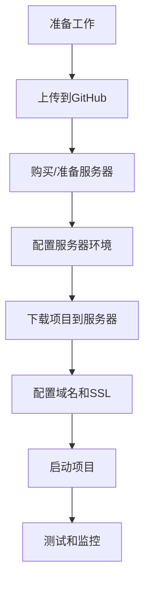

# 时光轴笔记项目 - 新手部署完整指南

> 🎯 **适用人群**: 纯新手小白  
> 📅 **更新时间**: 2025年1月22日  
> ⏱️ **预计完成时间**: 2-3小时  

---

## 📋 部署流程概览



---

## 🛠️ 第一步：准备工作

### 1.1 需要准备的账号和工具

#### 必需账号:
- **GitHub账号** (免费) - 用于存储代码
- **服务器提供商账号** (推荐阿里云/腾讯云) - 用于部署项目
- **域名注册商账号** (可选，推荐阿里云/腾讯云) - 用于绑定域名

#### 必需工具:
- **Git** - 代码版本管理工具
- **SSH客户端** (Windows推荐PuTTY或Windows Terminal)
- **文本编辑器** (推荐VS Code)

### 1.2 安装Git (Windows)

1. 访问 [https://git-scm.com/download/win](https://git-scm.com/download/win)
2. 下载并安装Git
3. 安装时选择默认选项即可
4. 打开命令提示符，输入 `git --version` 验证安装

---

## 📤 第二步：上传项目到GitHub

### 2.1 创建GitHub仓库

1. **登录GitHub**
   - 访问 [https://github.com](https://github.com)
   - 点击右上角 "Sign in" 登录

2. **创建新仓库**
   - 点击右上角 "+" 号
   - 选择 "New repository"
   - 填写仓库信息:
     - Repository name: `timeline-notebook`
     - Description: `时光轴笔记 - 个人时间线记录应用`
     - 选择 "Public" (公开) 或 "Private" (私有)
     - ✅ 勾选 "Add a README file"
   - 点击 "Create repository"

### 2.2 准备项目文件

在上传前，需要创建 `.gitignore` 文件来忽略不需要上传的文件:

```bash
# 在项目根目录创建 .gitignore 文件
echo "# 依赖文件
node_modules/
__pycache__/
*.pyc

# 环境配置文件
.env
.env.local
.env.production

# 数据库文件
*.db
*.sqlite
*.sqlite3

# 日志文件
logs/
*.log

# 上传文件
static/uploads/
uploads/

# 临时文件
.DS_Store
Thumbs.db

# IDE文件
.vscode/
.idea/

# SSL证书
ssl/
*.pem
*.key
*.crt" > .gitignore
```

### 2.3 上传代码到GitHub

#### 方法一: 使用Git命令行 (推荐)

1. **打开命令提示符**
   - 按 `Win + R`，输入 `cmd`，回车
   - 使用 `cd` 命令进入项目目录
   ```bash
   cd C:\Users\Administrator\Desktop\timeline-notebook-main\timeline-notebook-main
   ```

2. **初始化Git仓库**
   ```bash
   git init
   ```

3. **配置Git用户信息** (首次使用)
   ```bash
   git config --global user.name "你的用户名"
   git config --global user.email "你的邮箱@example.com"
   ```

4. **添加文件到Git**
   ```bash
   git add .
   ```

5. **提交代码**
   ```bash
   git commit -m "初始提交：时光轴笔记项目"
   ```

6. **连接到GitHub仓库**
   ```bash
   git remote add origin https://github.com/你的用户名/timeline-notebook.git
   ```

7. **推送代码到GitHub**
   ```bash
   git branch -M main
   git push -u origin main
   ```

#### 方法二: 使用GitHub Desktop (图形界面)

1. 下载并安装 [GitHub Desktop](https://desktop.github.com/)
2. 登录GitHub账号
3. 点击 "Clone a repository from the Internet"
4. 选择你刚创建的仓库
5. 选择本地存储位置
6. 将项目文件复制到克隆的文件夹中
7. 在GitHub Desktop中提交并推送更改

---

## 🖥️ 第三步：购买和配置服务器

### 3.1 服务器选择建议

#### 推荐配置:
- **CPU**: 2核心或以上
- **内存**: 4GB或以上
- **存储**: 40GB SSD或以上
- **带宽**: 5Mbps或以上
- **操作系统**: Ubuntu 20.04 LTS 或 Ubuntu 22.04 LTS

#### 服务器提供商推荐:

**阿里云ECS**:
- 新用户有优惠
- 国内访问速度快
- 中文客服支持

**腾讯云CVM**:
- 价格相对便宜
- 稳定性好
- 适合个人项目

**华为云ECS**:
- 企业级稳定性
- 技术支持完善

### 3.2 购买服务器步骤 (以阿里云为例)

1. **注册阿里云账号**
   - 访问 [https://www.aliyun.com](https://www.aliyun.com)
   - 点击 "免费注册"
   - 完成实名认证

2. **购买ECS实例**
   - 进入 "产品" -> "云服务器ECS"
   - 点击 "立即购买"
   - 选择配置:
     - 地域: 选择离你最近的地区
     - 实例规格: ecs.t5-lc2m1.nano (入门级) 或 ecs.t5-lc1m2.small
     - 镜像: Ubuntu 20.04 64位
     - 存储: 40GB 高效云盘
     - 网络: 默认VPC
     - 公网IP: 分配公网IPv4地址
     - 带宽: 按使用流量，峰值带宽5Mbps
   - 设置密码 (记住这个密码，后面SSH连接需要用)
   - 确认订单并支付

3. **配置安全组**
   - 在ECS控制台找到你的实例
   - 点击 "更多" -> "网络和安全组" -> "安全组配置"
   - 添加安全组规则:
     ```
     端口范围: 22/22 (SSH)
     授权对象: 0.0.0.0/0
     
     端口范围: 80/80 (HTTP)
     授权对象: 0.0.0.0/0
     
     端口范围: 443/443 (HTTPS)
     授权对象: 0.0.0.0/0
     ```

---

## 🔧 第四步：配置服务器环境

### 4.1 连接到服务器

#### Windows用户 - 使用PuTTY:

1. **下载PuTTY**
   - 访问 [https://www.putty.org/](https://www.putty.org/)
   - 下载并安装PuTTY

2. **连接服务器**
   - 打开PuTTY
   - Host Name: 输入服务器公网IP
   - Port: 22
   - Connection type: SSH
   - 点击 "Open"
   - 用户名: `root`
   - 密码: 购买服务器时设置的密码

#### Windows用户 - 使用Windows Terminal (推荐):

```bash
ssh root@你的服务器IP
# 输入密码
```

### 4.2 更新系统

```bash
# 更新软件包列表
sudo apt update

# 升级系统
sudo apt upgrade -y

# 安装基础工具
sudo apt install -y curl wget vim git unzip
```

### 4.3 安装Docker和Docker Compose

#### 安装Docker:

```bash
# 卸载旧版本
sudo apt-get remove docker docker-engine docker.io containerd runc

# 安装依赖
sudo apt-get update
sudo apt-get install -y \
    ca-certificates \
    curl \
    gnupg \
    lsb-release

# 添加Docker官方GPG密钥
sudo mkdir -p /etc/apt/keyrings
curl -fsSL https://download.docker.com/linux/ubuntu/gpg | sudo gpg --dearmor -o /etc/apt/keyrings/docker.gpg

# 添加Docker仓库
echo \
  "deb [arch=$(dpkg --print-architecture) signed-by=/etc/apt/keyrings/docker.gpg] https://download.docker.com/linux/ubuntu \
  $(lsb_release -cs) stable" | sudo tee /etc/apt/sources.list.d/docker.list > /dev/null

# 安装Docker Engine
sudo apt-get update
sudo apt-get install -y docker-ce docker-ce-cli containerd.io docker-compose-plugin

# 启动Docker服务
sudo systemctl start docker
sudo systemctl enable docker

# 验证安装
sudo docker --version
```

#### 安装Docker Compose:

```bash
# 下载Docker Compose
sudo curl -L "https://github.com/docker/compose/releases/latest/download/docker-compose-$(uname -s)-$(uname -m)" -o /usr/local/bin/docker-compose

# 添加执行权限
sudo chmod +x /usr/local/bin/docker-compose

# 验证安装
docker-compose --version
```

#### 配置Docker权限 (可选):

```bash
# 将当前用户添加到docker组
sudo usermod -aG docker $USER

# 重新登录或执行以下命令
newgrp docker

# 测试是否可以不用sudo运行docker
docker --version
```

---

## 📥 第五步：下载项目到服务器

### 5.1 克隆项目

```bash
# 进入用户主目录
cd ~

# 克隆项目 (替换为你的GitHub仓库地址)
git clone https://github.com/你的用户名/timeline-notebook.git

# 进入项目目录
cd timeline-notebook

# 查看项目文件
ls -la
```

### 5.2 配置环境变量

```bash
# 复制环境变量模板
cp .env.example .env

# 编辑环境变量文件
vim .env
```

在vim编辑器中:
1. 按 `i` 进入插入模式
2. 修改以下配置:

```bash
# 生产环境配置
FLASK_ENV=production
SECRET_KEY=你的随机密钥_请生成一个复杂的密钥
DATABASE_URL=sqlite:///data/timeline.db
UPLOAD_FOLDER=/app/static/uploads
MAX_CONTENT_LENGTH=104857600

# 域名配置 (替换为你的实际域名)
DOMAIN=your-domain.com

# CORS配置
CORS_ORIGINS=https://your-domain.com,https://www.your-domain.com

# 日志配置
LOG_LEVEL=WARNING

# 安全配置
SESSION_COOKIE_SECURE=true
SESSION_COOKIE_HTTPONLY=true
SESSION_COOKIE_SAMESITE=Lax
```

3. 按 `Esc` 退出插入模式
4. 输入 `:wq` 保存并退出

### 5.3 生成安全密钥

```bash
# 生成随机密钥
python3 -c "import secrets; print(secrets.token_hex(32))"

# 将生成的密钥替换到.env文件中的SECRET_KEY
```

### 5.4 配置前端环境变量

```bash
# 编辑前端环境变量
vim frontend/.env.production
```

修改内容:
```bash
# Timeline Notebook 前端生产环境配置

# API 基础URL (替换为你的域名)
VITE_API_BASE_URL=https://your-domain.com/api

# 媒体文件基础URL
VITE_MEDIA_BASE_URL=https://your-domain.com/static

# WebSocket基础URL
VITE_WS_BASE_URL=wss://your-domain.com

# 环境标识
VITE_APP_ENV=production

# 调试模式
VITE_DEBUG=false
```

---

## 🌐 第六步：配置域名和SSL证书

### 6.1 域名配置 (可选但推荐)

#### 购买域名:
1. 在阿里云/腾讯云购买域名
2. 完成域名实名认证
3. 配置DNS解析:
   - 记录类型: A
   - 主机记录: @
   - 记录值: 你的服务器公网IP
   - TTL: 600

#### 添加www子域名:
- 记录类型: CNAME
- 主机记录: www
- 记录值: your-domain.com
- TTL: 600

### 6.2 SSL证书配置

#### 方法一: 使用Let's Encrypt免费证书 (推荐)

```bash
# 安装Certbot
sudo apt install -y certbot python3-certbot-nginx

# 生成SSL证书 (替换为你的域名)
sudo certbot certonly --standalone -d your-domain.com -d www.your-domain.com

# 证书文件会保存在 /etc/letsencrypt/live/your-domain.com/
```

#### 复制证书到项目目录:

```bash
# 创建ssl目录
mkdir -p ~/timeline-notebook/ssl

# 复制证书文件
sudo cp /etc/letsencrypt/live/your-domain.com/fullchain.pem ~/timeline-notebook/ssl/
sudo cp /etc/letsencrypt/live/your-domain.com/privkey.pem ~/timeline-notebook/ssl/

# 修改文件权限
sudo chown $USER:$USER ~/timeline-notebook/ssl/*
chmod 644 ~/timeline-notebook/ssl/*
```

#### 设置自动续期:

```bash
# 添加定时任务
sudo crontab -e

# 添加以下行 (每月1号凌晨2点检查并续期)
0 2 1 * * /usr/bin/certbot renew --quiet
```

#### 方法二: 使用自签名证书 (仅用于测试)

```bash
# 进入项目目录
cd ~/timeline-notebook

# 运行SSL生成脚本
bash generate-ssl.sh
```

---

## 🚀 第七步：启动项目

### 7.1 构建和启动容器

```bash
# 进入项目目录
cd ~/timeline-notebook

# 构建并启动所有服务
docker-compose up -d --build

# 查看服务状态
docker-compose ps

# 查看日志
docker-compose logs

# 查看特定服务日志
docker-compose logs backend
docker-compose logs frontend
docker-compose logs nginx
```

### 7.2 验证服务启动

```bash
# 检查容器状态
docker ps

# 检查端口监听
sudo netstat -tlnp | grep :80
sudo netstat -tlnp | grep :443

# 测试健康检查
curl http://localhost/health
curl http://localhost/api/health
```

### 7.3 初始化数据库

```bash
# 进入后端容器
docker-compose exec backend bash

# 在容器内运行数据库初始化
python init_db.py

# 退出容器
exit
```

---

## 🧪 第八步：测试和验证

### 8.1 本地测试

```bash
# 测试HTTP访问
curl -I http://your-domain.com

# 测试HTTPS访问
curl -I https://your-domain.com

# 测试API接口
curl https://your-domain.com/api/health
```

### 8.2 浏览器测试

1. **打开浏览器**
2. **访问你的域名**: `https://your-domain.com`
3. **检查功能**:
   - 页面是否正常加载
   - 用户注册/登录功能
   - 时间线创建和编辑
   - 文件上传功能
   - 留言墙功能

### 8.3 性能测试

```bash
# 安装压力测试工具
sudo apt install -y apache2-utils

# 简单压力测试 (100个请求，并发10个)
ab -n 100 -c 10 https://your-domain.com/
```

---

## 📊 第九步：监控和维护

### 9.1 设置监控脚本

创建监控脚本:
```bash
vim ~/monitor.sh
```

脚本内容:
```bash
#!/bin/bash

# 检查服务状态
echo "=== Docker容器状态 ==="
docker-compose -f ~/timeline-notebook/docker-compose.yml ps

echo "\n=== 系统资源使用 ==="
free -h
df -h

echo "\n=== 网络连接 ==="
ss -tlnp | grep -E ':80|:443'

echo "\n=== 最近的错误日志 ==="
docker-compose -f ~/timeline-notebook/docker-compose.yml logs --tail=10 | grep -i error
```

添加执行权限:
```bash
chmod +x ~/monitor.sh
```

### 9.2 设置日志轮转

```bash
# 创建日志轮转配置
sudo vim /etc/logrotate.d/timeline-notebook
```

配置内容:
```bash
/home/*/timeline-notebook/logs/*.log {
    daily
    missingok
    rotate 30
    compress
    delaycompress
    notifempty
    copytruncate
}
```

### 9.3 设置自动备份

创建备份脚本:
```bash
vim ~/backup.sh
```

脚本内容:
```bash
#!/bin/bash

BACKUP_DIR="/home/backup/timeline-notebook"
DATE=$(date +%Y%m%d_%H%M%S)

# 创建备份目录
mkdir -p $BACKUP_DIR

# 备份数据库
cp ~/timeline-notebook/data/timeline.db $BACKUP_DIR/timeline_$DATE.db

# 备份上传文件
tar -czf $BACKUP_DIR/uploads_$DATE.tar.gz -C ~/timeline-notebook/static uploads

# 删除30天前的备份
find $BACKUP_DIR -name "*.db" -mtime +30 -delete
find $BACKUP_DIR -name "*.tar.gz" -mtime +30 -delete

echo "备份完成: $DATE"
```

添加到定时任务:
```bash
crontab -e

# 添加每天凌晨3点备份
0 3 * * * /home/$(whoami)/backup.sh >> /home/$(whoami)/backup.log 2>&1
```

---

## 🔧 常见问题排查

### 10.1 容器启动失败

**问题**: 容器无法启动

**排查步骤**:
```bash
# 查看详细错误日志
docker-compose logs

# 检查配置文件语法
docker-compose config

# 检查端口占用
sudo netstat -tlnp | grep :80
sudo netstat -tlnp | grep :443

# 重新构建容器
docker-compose down
docker-compose up --build
```

**常见解决方案**:
- 检查环境变量配置是否正确
- 确保SSL证书文件存在且权限正确
- 检查防火墙设置
- 确保Docker服务正在运行

### 10.2 域名无法访问

**问题**: 通过域名无法访问网站

**排查步骤**:
```bash
# 检查DNS解析
nslookup your-domain.com

# 检查服务器防火墙
sudo ufw status

# 检查云服务器安全组设置
# 确保80和443端口已开放

# 测试本地访问
curl -I http://localhost
```

### 10.3 SSL证书问题

**问题**: HTTPS访问出现证书错误

**排查步骤**:
```bash
# 检查证书文件
ls -la ~/timeline-notebook/ssl/

# 检查证书有效期
openssl x509 -in ~/timeline-notebook/ssl/fullchain.pem -text -noout | grep -A 2 "Validity"

# 测试SSL配置
openssl s_client -connect your-domain.com:443
```

### 10.4 数据库连接问题

**问题**: 应用无法连接数据库

**排查步骤**:
```bash
# 检查数据库文件权限
ls -la ~/timeline-notebook/data/

# 进入后端容器检查
docker-compose exec backend bash
python -c "from models import db; print('数据库连接正常')"

# 重新初始化数据库
python init_db.py
```

### 10.5 文件上传问题

**问题**: 无法上传文件

**排查步骤**:
```bash
# 检查上传目录权限
ls -la ~/timeline-notebook/static/

# 检查nginx配置中的文件大小限制
docker-compose exec nginx cat /etc/nginx/nginx.conf | grep client_max_body_size

# 检查后端日志
docker-compose logs backend | grep -i upload
```

---

## 📚 附录

### A.1 常用Docker命令

```bash
# 查看所有容器
docker ps -a

# 查看容器日志
docker logs 容器名

# 进入容器
docker exec -it 容器名 bash

# 重启容器
docker restart 容器名

# 停止所有容器
docker-compose down

# 重新构建并启动
docker-compose up -d --build

# 查看容器资源使用
docker stats
```

### A.2 常用系统命令

```bash
# 查看系统资源
top
htop
free -h
df -h

# 查看网络连接
ss -tlnp
netstat -tlnp

# 查看进程
ps aux | grep docker

# 查看系统日志
journalctl -u docker
sudo tail -f /var/log/syslog
```

### A.3 性能优化建议

1. **服务器优化**:
   - 定期更新系统
   - 配置swap分区
   - 优化内核参数

2. **Docker优化**:
   - 定期清理无用镜像: `docker system prune`
   - 使用多阶段构建减小镜像大小
   - 配置合适的资源限制

3. **应用优化**:
   - 启用Gzip压缩
   - 配置静态文件缓存
   - 使用CDN加速

### A.4 安全加固建议

1. **服务器安全**:
   ```bash
   # 禁用root登录
   sudo vim /etc/ssh/sshd_config
   # 设置 PermitRootLogin no
   
   # 配置防火墙
   sudo ufw enable
   sudo ufw allow 22
   sudo ufw allow 80
   sudo ufw allow 443
   
   # 定期更新系统
   sudo apt update && sudo apt upgrade
   ```

2. **应用安全**:
   - 定期更新依赖包
   - 使用强密码
   - 启用HTTPS
   - 配置安全头

---

## 🎉 完成！

恭喜！你已经成功将时光轴笔记项目部署到服务器上。现在你可以:

1. ✅ 通过域名访问你的应用
2. ✅ 创建用户账号并使用所有功能
3. ✅ 监控应用运行状态
4. ✅ 定期备份重要数据

如果遇到问题，请参考常见问题排查部分，或者查看项目的GitHub Issues页面寻求帮助。

**记住**:
- 定期备份数据
- 监控服务器资源使用情况
- 及时更新系统和应用依赖
- 关注安全更新

祝你使用愉快！ 🚀