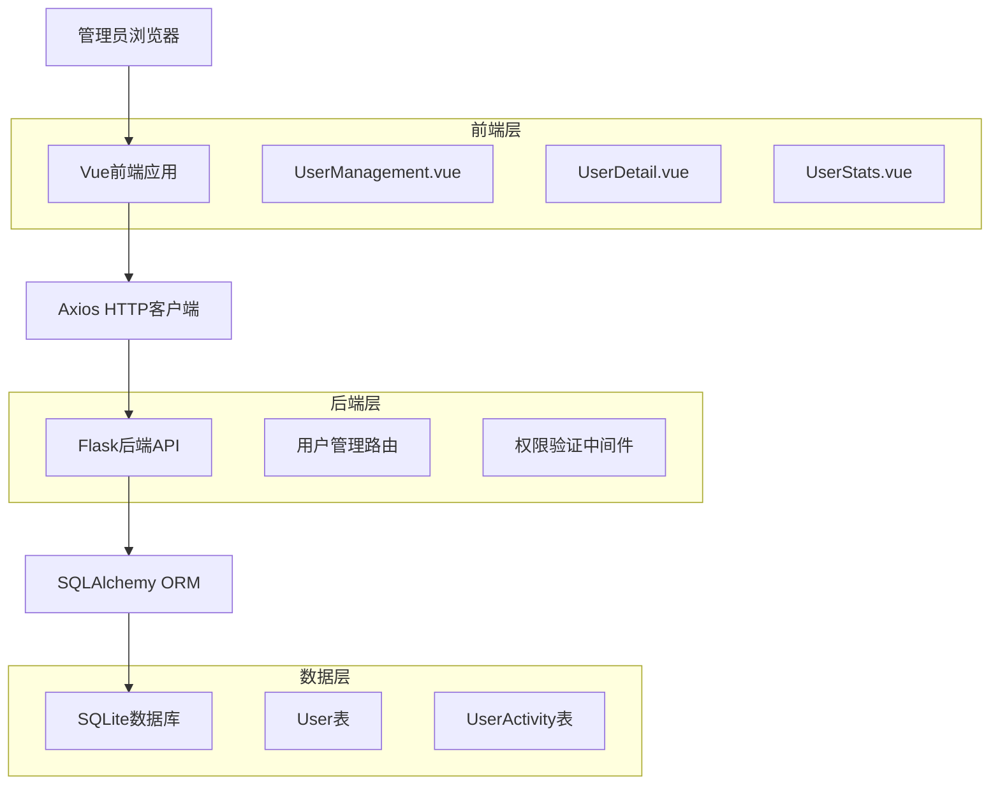
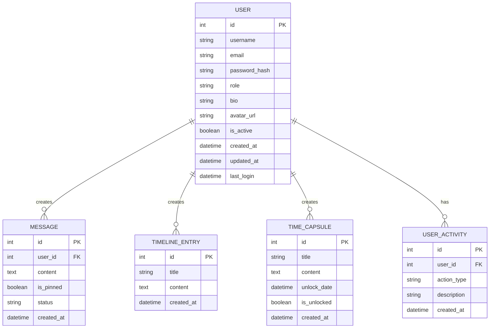

# 普通用户管理功能技术架构文档

## 1. 架构设计



## 2. 技术描述

* **前端**：Vue\@3 + Vue Router\@4 + Axios + CSS3

* **后端**：Flask\@2.3.3 + Flask-SQLAlchemy\@3.0.5

* **数据库**：SQLite（现有Supabase架构保持不变）

* **认证**：Session-based认证（现有机制）

## 3. 路由定义

| 路由               | 用途                           |
| ---------------- | ---------------------------- |
| /admin-dashboard | 管理员后台主页，包含用户管理标签页            |
| /admin/users     | 用户管理页面（作为AdminDashboard的子页面） |
| /admin/users/:id | 用户详情页面                       |
| /admin/stats     | 用户统计页面                       |

## 4. API定义

### 4.1 核心API

#### 用户列表管理

```
GET /api/admin/users
```

请求参数：

| 参数名         | 参数类型    | 是否必需  | 描述                         |
| ----------- | ------- | ----- | -------------------------- |
| page        | integer | false | 页码，默认1                     |
| per\_page   | integer | false | 每页数量，默认20                  |
| search      | string  | false | 搜索关键词（用户名或邮箱）              |
| status      | string  | false | 用户状态筛选（active/inactive）    |
| role        | string  | false | 用户角色筛选（user/admin）         |
| sort\_by    | string  | false | 排序字段（created\_at/username） |
| sort\_order | string  | false | 排序方向（asc/desc）             |

响应：

| 参数名          | 参数类型    | 描述   |
| ------------ | ------- | ---- |
| users        | array   | 用户列表 |
| total        | integer | 用户总数 |
| page         | integer | 当前页码 |
| per\_page    | integer | 每页数量 |
| total\_pages | integer | 总页数  |

示例：

```json
{
  "users": [
    {
      "id": 1,
      "username": "user1",
      "email": "user1@example.com",
      "role": "user",
      "is_active": true,
      "created_at": "2024-01-01 10:00:00",
      "last_login": "2024-01-15 14:30:00",
      "message_count": 5,
      "timeline_count": 3
    }
  ],
  "total": 100,
  "page": 1,
  "per_page": 20,
  "total_pages": 5
}
```

#### 用户详情管理

```
GET /api/admin/users/{user_id}
```

响应：

| 参数名                | 参数类型   | 描述     |
| ------------------ | ------ | ------ |
| user               | object | 用户详细信息 |
| activity           | object | 用户活动统计 |
| recent\_activities | array  | 最近活动记录 |

```
PUT /api/admin/users/{user_id}
```

请求：

| 参数名        | 参数类型    | 是否必需  | 描述   |
| ---------- | ------- | ----- | ---- |
| username   | string  | false | 用户名  |
| email      | string  | false | 邮箱   |
| bio        | string  | false | 用户简介 |
| is\_active | boolean | false | 是否激活 |
| role       | string  | false | 用户角色 |

#### 用户状态管理

```
POST /api/admin/users/{user_id}/toggle-status
```

请求：

| 参数名        | 参数类型    | 是否必需 | 描述   |
| ---------- | ------- | ---- | ---- |
| is\_active | boolean | true | 目标状态 |

```
POST /api/admin/users/{user_id}/reset-password
```

响应：

| 参数名           | 参数类型   | 描述      |
| ------------- | ------ | ------- |
| new\_password | string | 新密码（临时） |

#### 批量操作

```
POST /api/admin/users/batch-action
```

请求：

| 参数名       | 参数类型   | 是否必需 | 描述                               |
| --------- | ------ | ---- | -------------------------------- |
| user\_ids | array  | true | 用户ID列表                           |
| action    | string | true | 操作类型（activate/deactivate/delete） |

#### 用户统计

```
GET /api/admin/users/stats
```

响应：

| 参数名               | 参数类型    | 描述     |
| ----------------- | ------- | ------ |
| total\_users      | integer | 用户总数   |
| active\_users     | integer | 活跃用户数  |
| new\_users\_today | integer | 今日新增用户 |
| new\_users\_week  | integer | 本周新增用户 |
| new\_users\_month | integer | 本月新增用户 |
| user\_growth      | array   | 用户增长趋势 |

```
GET /api/admin/users/{user_id}/content
```

响应：

| 参数名               | 参数类型  | 描述      |
| ----------------- | ----- | ------- |
| messages          | array | 用户留言列表  |
| timeline\_entries | array | 时光轴条目列表 |
| time\_capsules    | array | 时间胶囊列表  |

## 5. 数据模型

### 5.1 数据模型定义



### 5.2 数据定义语言

#### 用户活动记录表（user\_activities）

```sql
-- 创建用户活动记录表
CREATE TABLE user_activities (
    id INTEGER PRIMARY KEY AUTOINCREMENT,
    user_id INTEGER NOT NULL,
    action_type VARCHAR(50) NOT NULL,
    description TEXT,
    ip_address VARCHAR(45),
    user_agent TEXT,
    created_at TIMESTAMP DEFAULT CURRENT_TIMESTAMP,
    FOREIGN KEY (user_id) REFERENCES user(id) ON DELETE CASCADE
);

-- 创建索引
CREATE INDEX idx_user_activities_user_id ON user_activities(user_id);
CREATE INDEX idx_user_activities_created_at ON user_activities(created_at DESC);
CREATE INDEX idx_user_activities_action_type ON user_activities(action_type);

-- 为现有用户表添加字段
ALTER TABLE user ADD COLUMN last_login TIMESTAMP;
ALTER TABLE user ADD COLUMN login_count INTEGER DEFAULT 0;

-- 初始化数据
INSERT INTO user_activities (user_id, action_type, description)
SELECT id, 'register', '用户注册' FROM user WHERE created_at IS NOT NULL;
```

#### 权限控制相关

```sql
-- 创建权限表（可选，用于更细粒度的权限控制）
CREATE TABLE permissions (
    id INTEGER PRIMARY KEY AUTOINCREMENT,
    name VARCHAR(100) NOT NULL UNIQUE,
    description TEXT,
    created_at TIMESTAMP DEFAULT CURRENT_TIMESTAMP
);

-- 创建用户权限关联表
CREATE TABLE user_permissions (
    id INTEGER PRIMARY KEY AUTOINCREMENT,
    user_id INTEGER NOT NULL,
    permission_id INTEGER NOT NULL,
    granted_at TIMESTAMP DEFAULT CURRENT_TIMESTAMP,
    granted_by INTEGER,
    FOREIGN KEY (user_id) REFERENCES user(id) ON DELETE CASCADE,
    FOREIGN KEY (permission_id) REFERENCES permissions(id) ON DELETE CASCADE,
    FOREIGN KEY (granted_by) REFERENCES user(id),
    UNIQUE(user_id, permission_id)
);

-- 初始化基础权限
INSERT INTO permissions (name, description) VALUES
('create_timeline', '创建时光轴条目'),
('create_message', '发布留言'),
('create_capsule', '创建时间胶囊'),
('admin_users', '管理用户'),
('admin_content', '管理内容'),
('admin_system', '系统管理');
```

## 6. 安全考虑

### 6.1 权限验证

* 所有管理员API都需要验证用户角色为'admin'

* 使用装饰器统一处理权限验证

* 敏感操作需要二次确认

### 6.2 数据保护

* 用户密码重置生成临时密码，强制用户首次登录修改

* 用户删除采用软删除，保留数据备份

* 批量操作限制单次处理数量

### 6.3 操作日志

* 记录所有管理员操作日

