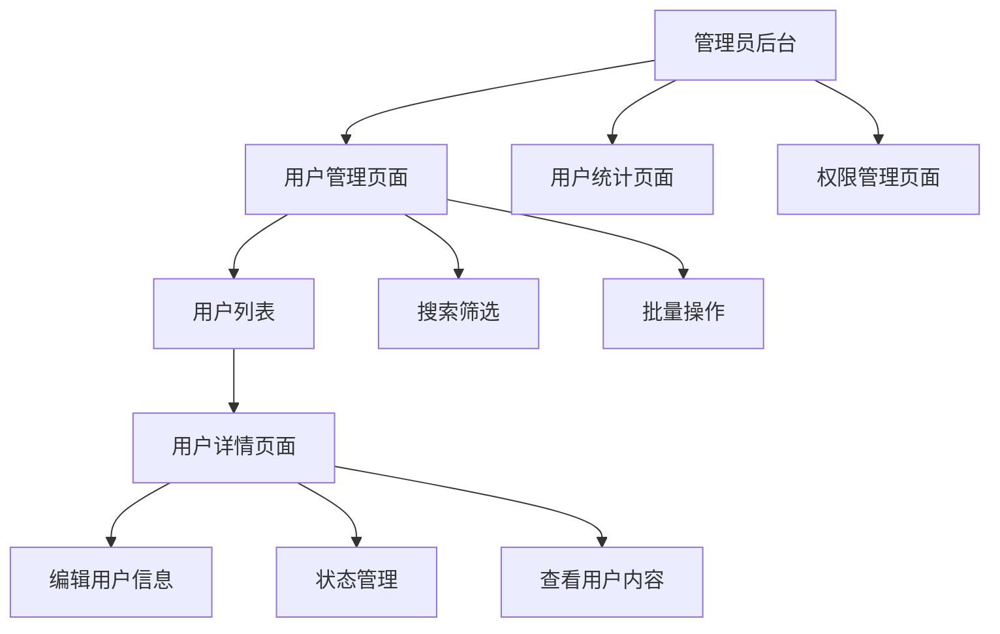

# 普通用户管理功能需求文档

## 1. 产品概述

时间轴笔记本应用当前缺少对普通用户的完整管理功能。本文档旨在设计一套完整的用户管理系统，为管理员提供用户管理、监控和维护的能力。

该功能将帮助管理员更好地管理平台用户，提升用户体验和平台安全性，同时为平台运营提供数据支持。

## 2. 核心功能

### 2.1 用户角色

| 角色   | 注册方式         | 核心权限                |
| ---- | ------------ | ------------------- |
| 管理员  | 系统预设或超级管理员创建 | 可管理所有用户、查看所有数据、系统配置 |
| 普通用户 | 邮箱注册         | 可使用基本功能、管理个人数据      |

### 2.2 功能模块

本用户管理功能包含以下主要页面：

1. **用户管理页面**：用户列表查看、搜索筛选、批量操作
2. **用户详情页面**：用户信息查看、编辑、状态管理
3. **用户统计页面**：用户数据统计、活跃度分析
4. **权限管理页面**：用户权限设置、角色管理

### 2.3 页面详情

| 页面名称   | 模块名称  | 功能描述                    |
| ------ | ----- | ----------------------- |
| 用户管理页面 | 用户列表  | 显示所有用户列表，支持分页、搜索、排序     |
| 用户管理页面 | 搜索筛选  | 按用户名、邮箱、注册时间、状态筛选用户     |
| 用户管理页面 | 批量操作  | 批量启用/禁用用户、批量删除用户        |
| 用户详情页面 | 基本信息  | 查看和编辑用户基本信息（用户名、邮箱、简介等） |
| 用户详情页面 | 状态管理  | 启用/禁用用户账户、重置密码          |
| 用户详情页面 | 活动记录  | 查看用户登录记录、操作日志           |
| 用户详情页面 | 内容管理  | 查看用户发布的留言、时光轴条目、时间胶囊    |
| 用户统计页面 | 数据概览  | 用户总数、活跃用户数、新增用户趋势       |
| 用户统计页面 | 活跃度分析 | 用户登录频率、内容发布统计           |
| 权限管理页面 | 角色设置  | 设置用户角色（普通用户/管理员）        |
| 权限管理页面 | 权限控制  | 设置用户功能权限、访问限制           |

## 3. 核心流程

### 管理员用户管理流程

1. **用户列表查看**：管理员进入用户管理页面 → 查看用户列表 → 使用搜索筛选功能
2. **用户信息管理**：选择用户 → 进入用户详情页面 → 编辑用户信息 → 保存更改
3. **用户状态管理**：选择用户 → 执行启用/禁用操作 → 确认操作
4. **批量用户操作**：选择多个用户 → 执行批量操作 → 确认操作
5. **用户数据查看**：进入用户统计页面 → 查看数据报表 → 导出数据

## 4. 用户界面设计

### 4.1 设计风格

* **主色调**：#3b82f6（蓝色）、#10b981（绿色）

* **辅助色**：#ef4444（红色警告）、#f59e0b（橙色提醒）

* **按钮样式**：圆角矩形，渐变背景

* **字体**：系统默认字体，标题16px，正文14px，辅助文字12px

* **布局风格**：卡片式布局，顶部导航，左侧菜单

* **图标风格**：线性图标，配合emoji表情符号

### 4.2 页面设计概览

| 页面名称   | 模块名称 | UI元素                       |
| ------ | ---- | -------------------------- |
| 用户管理页面 | 用户列表 | 表格布局，头像、用户名、邮箱、状态、操作按钮，分页器 |
| 用户管理页面 | 搜索筛选 | 搜索框、下拉筛选器、日期选择器、重置按钮       |
| 用户详情页面 | 基本信息 | 表单布局，输入框、文本域、保存按钮          |
| 用户详情页面 | 状态管理 | 开关按钮、状态标签、操作确认弹窗           |
| 用户统计页面 | 数据概览 | 卡片式数据展示，图表组件，数据导出按钮        |
| 权限管理页面 | 角色设置 | 下拉选择器、权限复选框、保存按钮           |

### 4.3 响应式设计

* **桌面优先**：主要针对管理员在桌面端使用

* **移动适配**：支持平板和手机访问，采用响应式布局

* \*\*触摸优

