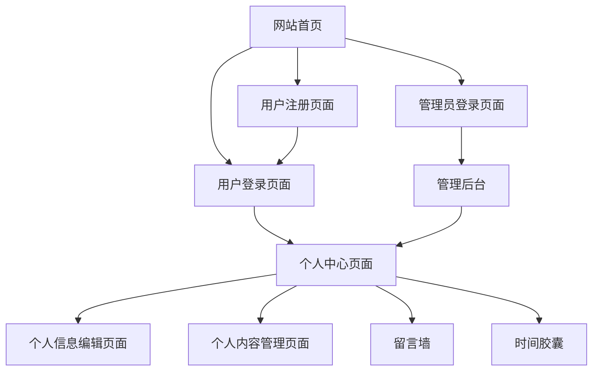

## 1. Product Overview

时间轴笔记本网站用户系统完善项目，旨在将原本仅限管理员使用的网站开放给所有用户，提供完整的用户注册、登录和个人中心功能。

* 解决当前网站仅支持管理员访问的限制，让普通用户也能注册账号、发布留言、管理个人信息

* 为用户提供个性化的个人中心，包含个人信息管理、数据统计、内容管理等功能

## 2. Core Features

### 2.1 User Roles

| Role | Registration Method | Core Permissions                |
| ---- | ------------------- | ------------------------------- |
| 普通用户 | 邮箱注册或用户名注册          | 可浏览内容、发布留言、管理个人信息、查看个人数据        |
| 管理员  | 系统预设或管理员邀请          | 拥有普通用户所有权限，另可管理所有用户内容、系统设置、用户管理 |

### 2.2 Feature Module

我们的用户系统需求包含以下主要页面：

1. **用户注册页面**：注册表单、验证逻辑、成功提示
2. **用户登录页面**：登录表单、记住登录状态、忘记密码链接
3. **个人中心页面**：个人信息展示、数据统计、内容管理、设置选项
4. **个人信息编辑页面**：基本信息修改、头像上传、密码修改
5. **个人内容管理页面**：我的留言、我的时间胶囊、内容统计

### 2.3 Page Details

| Page Name | Module Name | Feature description                |
| --------- | ----------- | ---------------------------------- |
| 用户注册页面    | 注册表单        | 用户名输入、密码设置、密码确认、邮箱输入（可选）、表单验证、注册提交 |
| 用户注册页面    | 验证逻辑        | 用户名唯一性检查、密码强度验证、邮箱格式验证、实时错误提示      |
| 用户注册页面    | 成功提示        | 注册成功消息、自动跳转登录、引导用户完善信息             |
| 用户登录页面    | 登录表单        | 用户名/邮箱输入、密码输入、记住我选项、登录提交           |
| 用户登录页面    | 状态管理        | 登录状态保持、会话管理、自动登录、登录跳转              |
| 个人中心页面    | 个人信息展示      | 头像显示、用户名、注册时间、角色标识、个人简介            |
| 个人中心页面    | 数据统计        | 发布留言数量、获得点赞数、时间胶囊数量、活跃天数统计         |
| 个人中心页面    | 快捷操作        | 发布新留言、创建时间胶囊、编辑个人信息、查看我的内容         |
| 个人信息编辑页面  | 基本信息编辑      | 用户名修改、邮箱修改、个人简介编辑、保存更新             |
| 个人信息编辑页面  | 头像管理        | 头像上传、头像预览、头像删除、支持多种格式              |
| 个人信息编辑页面  | 密码管理        | 当前密码验证、新密码设置、密码确认、安全提示             |
| 个人内容管理页面  | 我的留言        | 留言列表、编辑留言、删除留言、留言状态管理              |
| 个人内容管理页面  | 我的时间胶囊      | 胶囊列表、查看详情、编辑胶囊、删除胶囊                |
| 个人内容管理页面  | 内容统计        | 内容发布趋势、互动数据、热门内容排行                 |

## 3. Core Process

### 普通用户流程

1. 用户访问网站首页，点击注册按钮
2. 填写注册信息（用户名、密码、邮箱），完成注册
3. 注册成功后自动跳转到登录页面
4. 用户登录成功后可以浏览内容、发布留言
5. 用户可以访问个人中心查看和管理个人信息
6. 用户可以在个人中心查看自己发布的内容和数据统计

### 管理员流程

1. 管理员通过专用登录页面登录
2. 登录后可以访问管理后台
3. 管理员可以管理所有用户内容和系统设置
4. 管理员也可以像普通用户一样使用个人中心功能

## 4. User Interface Design

### 4.1 Design Style

* 主色调：深蓝色 (#2c3e50) 和浅蓝色 (#3498db)

* 辅助色：白色 (#ffffff) 和浅灰色 (#ecf0f1)

* 按钮样式：圆角按钮，悬停效果，渐变背景

* 字体：系统默认字体，标题 18-24px，正文 14-16px

* 布局风格：卡片式布局，顶部导航，响应式设计

* 图标风格：简洁的线性图标，统一的视觉风格

### 4.2 Page Design Overview

| Page Name | Module Name | UI Elements                   |
| --------- | ----------- | ----------------------------- |
| 用户注册页面    | 注册表单        | 居中卡片布局，白色背景，圆角边框，蓝色主按钮，输入框带图标 |
| 用户登录页面    | 登录表单        | 与注册页面保持一致的设计风格，添加"记住我"复选框     |
| 个人中心页面    | 个人信息展示      | 左侧头像和基本信息，右侧数据统计卡片，网格布局       |
| 个人中心页面    | 数据统计        | 四个统计卡片，每个卡片包含数字、图标和描述文字       |
| 个人中心页面    | 快捷操作        | 水平排列的操作按钮，带图标和文字说明            |
| 个人信息编辑页面  | 表单区域        | 分组的表单字段，清晰的标签，实时验证提示          |
| 个人信息编辑页面  | 头像上传        | 圆形头像预览，上传按钮，支持拖拽上传            |
| 个人内容管理页面  | 内容列表        | 表格或卡片列表，带搜索和筛选功能              |

### 4.3 Responsiveness

* 采用移动优先的响应式设计

* 支持桌面端、平板和手机端适配

* 触摸友好的交互设计

* 在小屏幕设备上优化表单和按钮大小

