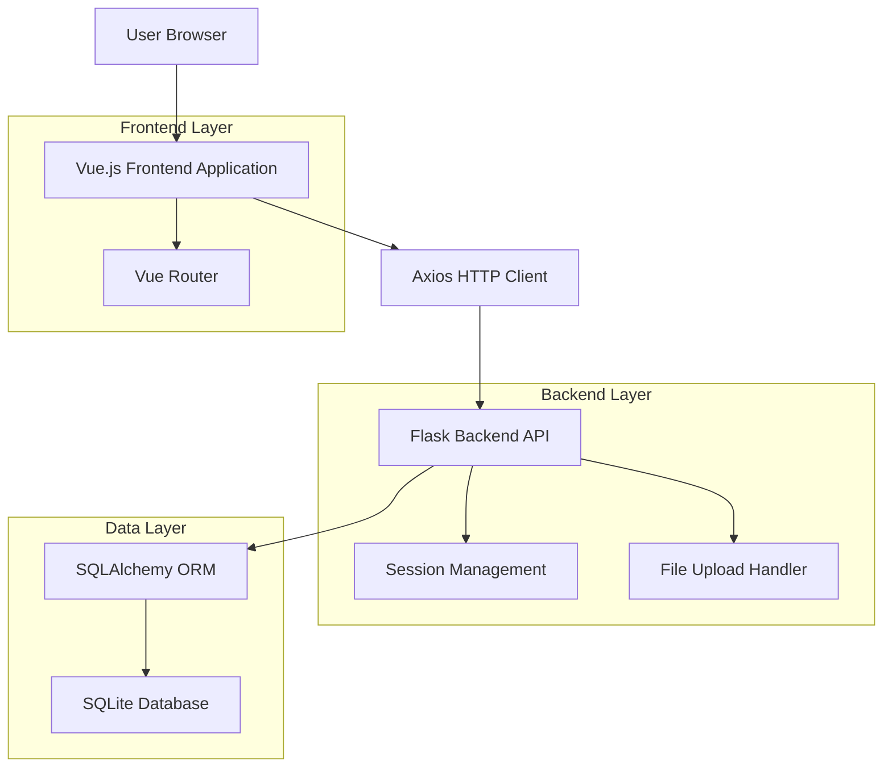
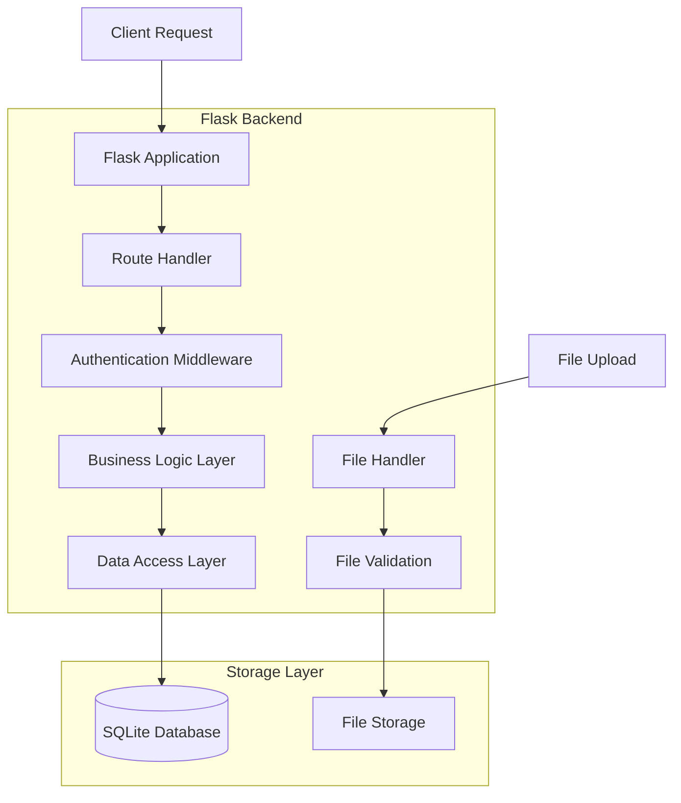
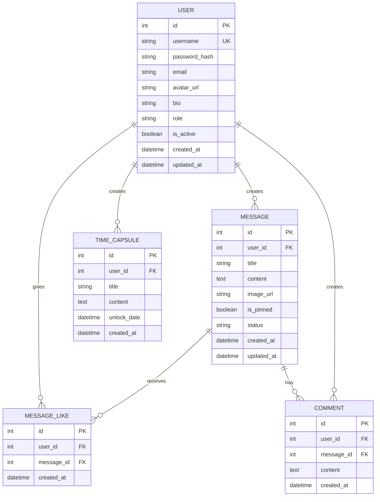

## 1.Architecture design



## 2.Technology Description

* Frontend: Vue\@3 + Vue Router\@4 + Axios + CSS3

* Backend: Flask + SQLAlchemy + Flask-Session

* Database: SQLite (现有)

* File Storage: 本地文件系统（头像上传）

## 3.Route definitions

| Route             | Purpose            |
| ----------------- | ------------------ |
| /                 | 首页，显示网站主要内容和导航     |
| /register         | 用户注册页面             |
| /login            | 用户登录页面             |
| /profile          | 个人中心页面，显示用户信息和统计数据 |
| /profile/edit     | 个人信息编辑页面           |
| /profile/content  | 个人内容管理页面           |
| /admin-login      | 管理员登录页面（现有）        |
| /admin-dashboard  | 管理后台页面（现有）         |
| /messages         | 留言墙页面（现有）          |
| /messages/publish | 发布留言页面（现有）         |
| /messages/:id     | 留言详情页面（现有）         |
| /time-capsules    | 时间胶囊列表页面（现有）       |

## 4.API definitions

### 4.1 Core API

#### 用户注册

```
POST /api/register
```

Request:

| Param Name | Param Type | isRequired | Description |
| ---------- | ---------- | ---------- | ----------- |
| username   | string     | true       | 用户名，3-20个字符 |
| password   | string     | true       | 密码，6-50个字符  |
| email      | string     | false      | 邮箱地址        |

Response:

| Param Name | Param Type | Description |
| ---------- | ---------- | ----------- |
| message    | string     | 响应消息        |
| user\_id   | integer    | 新创建的用户ID    |

Example:

```json
{
  "username": "newuser",
  "password": "password123",
  "email": "user@example.com"
}
```

#### 用户登录

```
POST /api/login
```

Request:

| Param Name | Param Type | isRequired | Description |
| ---------- | ---------- | ---------- | ----------- |
| username   | string     | true       | 用户名或邮箱      |
| password   | string     | true       | 密码          |

Response:

| Param Name | Param Type | Description |
| ---------- | ---------- | ----------- |
| message    | string     | 响应消息        |
| user       | object     | 用户信息对象      |

#### 获取用户信息

```
GET /api/user/profile
```

Response:

| Param Name  | Param Type | Description |
| ----------- | ---------- | ----------- |
| id          | integer    | 用户ID        |
| username    | string     | 用户名         |
| email       | string     | 邮箱          |
| avatar\_url | string     | 头像URL       |
| created\_at | string     | 注册时间        |
| role        | string     | 用户角色        |

#### 更新用户信息

```
PUT /api/user/profile
```

Request:

| Param Name | Param Type | isRequired | Description |
| ---------- | ---------- | ---------- | ----------- |
| username   | string     | false      | 新用户名        |
| email      | string     | false      | 新邮箱         |
| bio        | string     | false      | 个人简介        |

#### 修改密码

```
PUT /api/user/password
```

Request:

| Param Name        | Param Type | isRequired | Description |
| ----------------- | ---------- | ---------- | ----------- |
| current\_password | string     | true       | 当前密码        |
| new\_password     | string     | true       | 新密码         |

#### 头像上传

```
POST /api/user/avatar
```

Request: FormData with file

| Param Name | Param Type | isRequired | Description          |
| ---------- | ---------- | ---------- | -------------------- |
| avatar     | file       | true       | 头像文件 (jpg, png, gif) |

Response:

| Param Name  | Param Type | Description |
| ----------- | ---------- | ----------- |
| avatar\_url | string     | 新头像URL      |

#### 获取用户统计数据

```
GET /api/user/stats
```

Response:

| Param Name     | Param Type | Description |
| -------------- | ---------- | ----------- |
| message\_count | integer    | 发布留言数量      |
| like\_count    | integer    | 获得点赞数量      |
| capsule\_count | integer    | 时间胶囊数量      |
| active\_days   | integer    | 活跃天数        |

#### 获取用户内容

```
GET /api/user/content
```

Query Parameters:

| Param Name | Param Type | isRequired | Description              |
| ---------- | ---------- | ---------- | ------------------------ |
| type       | string     | false      | 内容类型: messages, capsules |
| page       | integer    | false      | 页码，默认1                   |
| limit      | integer    | false      | 每页数量，默认10                |

Response:

| Param Name | Param Type | Description |
| ---------- | ---------- | ----------- |
| items      | array      | 内容列表        |
| total      | integer    | 总数量         |
| page       | integer    | 当前页码        |
| pages      | integer    | 总页数         |

## 5.Server architecture diagram



## 6.Data model

### 6.1 Data model definition



### 6.2 Data Definition Language

#### 用户表扩展 (users)

```sql
-- 为现有用户表添加新字段
ALTER TABLE users ADD COLUMN bio TEXT;
ALTER TABLE users ADD COLUMN last_login_at TIMESTAMP;

-- 创建索引
CREATE INDEX idx_users_email ON users(email);
CREATE INDEX idx_users_created_at ON users(created_at);
```

#### 留言表扩展 (messages)

```sql
-- 为留言表添加用户关联
ALTER TABLE messages ADD COLUMN user_id INTEGER;
ALTER TABLE messages ADD CONSTRAINT fk_messages_user_id 
  FOREIGN KEY (user_id) REFERENCES users(id);

-- 创建索引
CREATE INDEX idx_messages_user_id ON messages(user_id);
CREATE INDEX idx_messages_status ON messages(status);
```

#### 时间胶囊表扩展 (time\_capsules)

```sql
-- 为时间胶囊表添加用户关联
ALTER TABLE time_capsules ADD COLUMN user_id INTEGER;
ALTER TABLE time_capsules ADD CONSTRAINT fk_time_capsules_user_id 
  FOREIGN KEY (user_id) REFERENCES users(id);

-- 创建索引
CREATE INDEX idx_time_capsules_user_id ON time_capsules(user_id);
CREATE INDEX idx_time_capsules_unlock_date ON time_capsules(unlock_date);
```

#### 留言点赞表 (message\_likes)

```sql
-- 创建留言点赞表
CREATE TABLE message_likes (
    id INTEGER PRIMARY KEY AUTOINCREMENT,
    user_id INTEGER NOT NULL,
    message_id INTEGER NOT NULL,
    created_at TIMESTAMP DEFAULT CURRENT_TIMESTAMP,
    FOREIGN KEY (user_id) REFERENCES users(id) ON DELETE CASCADE,
    FOREIGN KEY (message_id) REFERENCES messages(id) ON DELETE CASCADE,
    UNIQUE(user_id, message_id)
);

-- 创建索引
CREATE INDEX idx_message_likes_user_id ON message_likes(user_id);
CREATE INDEX idx_message_likes_message_id ON message_likes(message_id);
```

#### 留言评论表 (comments)

```sql
-- 创建留言评论表
CREATE TABLE comments (
    id INTEGER PRIMARY KEY AUTOINCREMENT,
    user_id INTEGER NOT NULL,
    message_id INTEGER NOT NULL,
    content TEXT NOT NULL,
    created_at TIMESTAMP DEFAULT CURRENT_TIMESTAMP,
    FOREIGN KEY (user_id) REFERENCES users(id) ON DELETE CASCADE,
    FOREIGN KEY (message_id) REFERENCES messages(id) ON DELETE CASCADE
);

-- 创建索引
CREATE INDEX idx_comments_user_id ON comments(user_id);
CREATE INDEX idx_comments_message_id ON comments(message_id);
CREATE INDEX idx_comments_created_at ON comments(created_at DESC);
```

#### 初始化数据

```sql
-- 更新现有留言的用户关联（如果需要）
-- UPDATE messages SET user_id = 1 WHERE user_id IS NULL;

-- 更新现有时间胶囊的用户关联（如果需要）
-- UPDATE time_capsules SET user_id = 1 WHERE user_id IS NULL;
```

