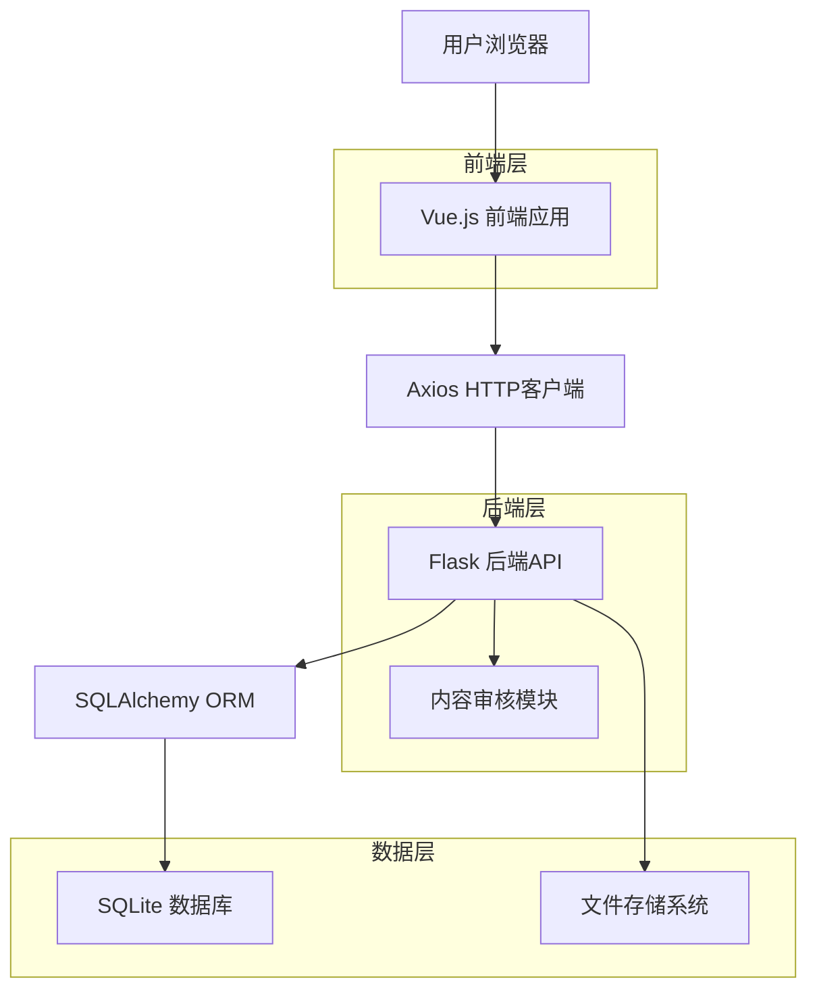
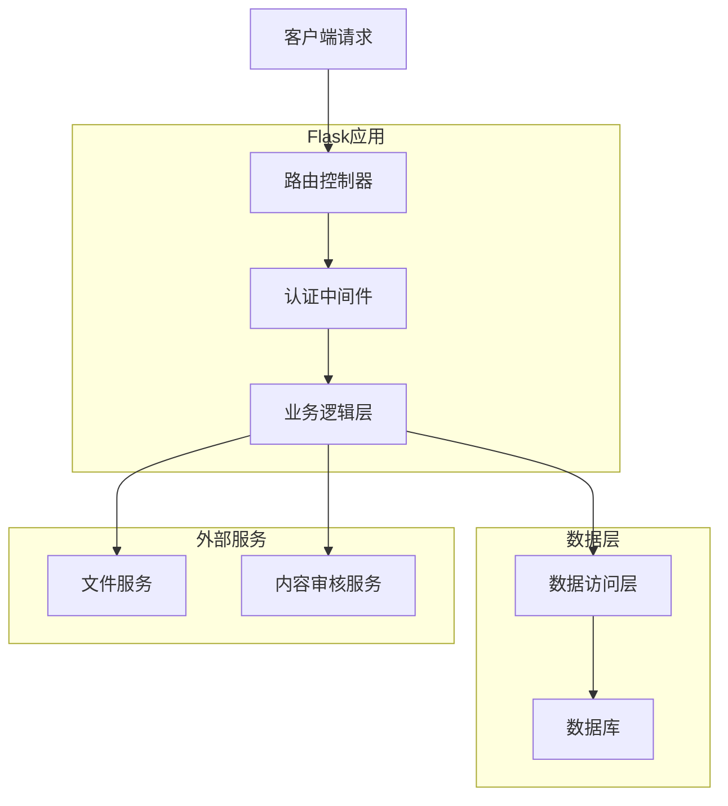
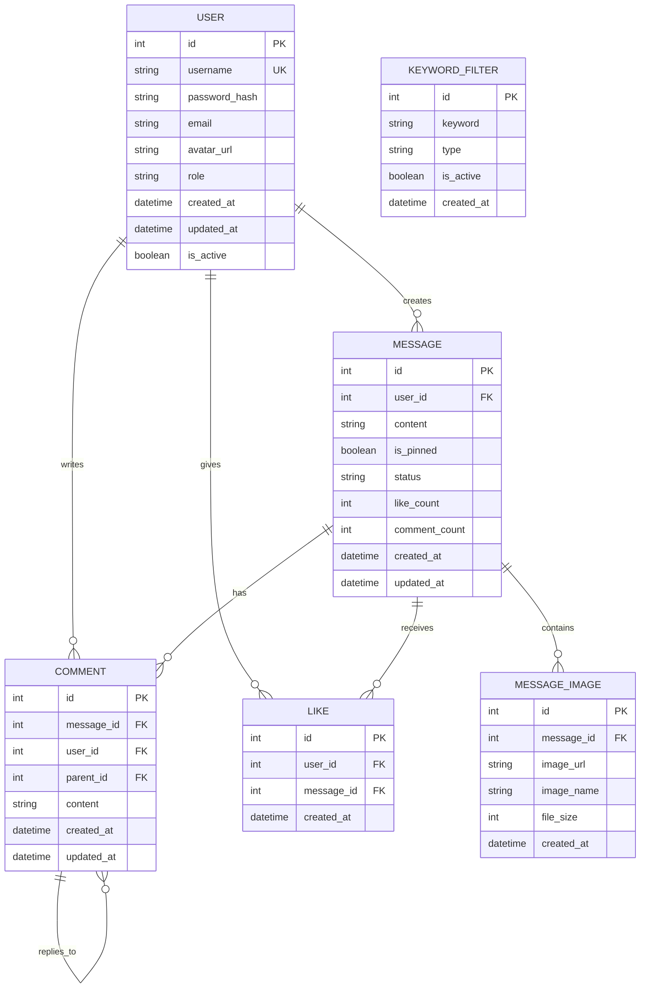

# 留言墙功能技术架构文档

## 1. 架构设计



## 2. 技术描述

* 前端：Vue.js\@3 + Vue Router + Axios + Element Plus UI组件库

* 后端：Flask\@2 + SQLAlchemy + Flask-Session

* 数据库：SQLite（现有）

* 文件存储：本地文件系统

* 内容审核：Python关键词过滤库

## 3. 路由定义

| 路由                 | 用途                  |
| ------------------ | ------------------- |
| /message-wall      | 留言墙主页，显示所有留言列表和发布入口 |
| /message-wall/post | 留言发布页面，支持文字和图片发布    |
| /message-wall/:id  | 留言详情页面，显示完整内容和评论    |
| /profile           | 个人中心页面，显示用户信息和个人留言  |
| /admin/messages    | 管理后台留言管理页面          |
| /admin/users       | 管理后台用户管理页面          |
| /admin/audit       | 管理后台内容审核页面          |

## 4. API定义

### 4.1 核心API

#### 留言相关API

```
GET /api/messages
```

获取留言列表

请求参数：

| 参数名      | 参数类型    | 是否必需  | 描述                   |
| -------- | ------- | ----- | -------------------- |
| page     | integer | false | 页码，默认1               |
| limit    | integer | false | 每页数量，默认20            |
| sort     | string  | false | 排序方式：time/hot，默认time |
| user\_id | integer | false | 筛选指定用户的留言            |

响应：

| 参数名       | 参数类型    | 描述      |
| --------- | ------- | ------- |
| messages  | array   | 留言列表    |
| total     | integer | 总数量     |
| page      | integer | 当前页码    |
| has\_more | boolean | 是否有更多数据 |

```
POST /api/messages
```

发布新留言

请求：

| 参数名     | 参数类型   | 是否必需  | 描述     |
| ------- | ------ | ----- | ------ |
| content | string | true  | 留言内容   |
| images  | array  | false | 图片文件列表 |

响应：

| 参数名         | 参数类型    | 描述       |
| ----------- | ------- | -------- |
| message\_id | integer | 新创建的留言ID |
| status      | string  | 创建状态     |

```
PUT /api/messages/{id}
```

修改留言（仅作者和管理员）

```
DELETE /api/messages/{id}
```

删除留言（仅作者和管理员）

```
POST /api/messages/{id}/like
```

点赞/取消点赞

```
POST /api/messages/{id}/pin
```

置顶留言（仅管理员）

#### 评论相关API

```
GET /api/messages/{id}/comments
```

获取留言评论列表

```
POST /api/messages/{id}/comments
```

发布评论

请求：

| 参数名        | 参数类型    | 是否必需  | 描述          |
| ---------- | ------- | ----- | ----------- |
| content    | string  | true  | 评论内容        |
| parent\_id | integer | false | 父评论ID（回复功能） |

#### 用户相关API

```
GET /api/users/{id}/profile
```

获取用户资料

```
PUT /api/users/{id}/profile
```

更新用户资料

```
GET /api/users/{id}/messages
```

获取用户的留言列表

#### 管理员API

```
GET /api/admin/messages
```

管理员获取所有留言（包含审核状态）

```
POST /api/admin/messages/{id}/audit
```

审核留言

请求：

| 参数名    | 参数类型   | 是否必需  | 描述                     |
| ------ | ------ | ----- | ---------------------- |
| status | string | true  | 审核状态：approved/rejected |
| reason | string | false | 审核原因                   |

```
GET /api/admin/keywords
```

获取关键词过滤列表

```
POST /api/admin/keywords
```

添加过滤关键词

## 5. 服务器架构图



## 6. 数据模型

### 6.1 数据模型定义



### 6.2 数据定义语言

#### 用户表扩展 (users)

```sql
-- 扩展现有用户表
ALTER TABLE users ADD COLUMN email VARCHAR(255);
ALTER TABLE users ADD COLUMN avatar_url VARCHAR(500);
ALTER TABLE users ADD COLUMN is_active BOOLEAN DEFAULT true;
ALTER TABLE users ADD COLUMN created_at TIMESTAMP DEFAULT CURRENT_TIMESTAMP;
ALTER TABLE users ADD COLUMN updated_at TIMESTAMP DEFAULT CURRENT_TIMESTAMP;

-- 创建索引
CREATE INDEX idx_users_email ON users(email);
CREATE INDEX idx_users_is_active ON users(is_active);
```

#### 留言表 (messages)

```sql
-- 创建留言表
CREATE TABLE messages (
    id INTEGER PRIMARY KEY AUTOINCREMENT,
    user_id INTEGER NOT NULL,
    content TEXT NOT NULL,
    is_pinned BOOLEAN DEFAULT false,
    status VARCHAR(20) DEFAULT 'published', -- published, pending, rejected
    like_count INTEGER DEFAULT 0,
    comment_count INTEGER DEFAULT 0,
    created_at TIMESTAMP DEFAULT CURRENT_TIMESTAMP,
    updated_at TIMESTAMP DEFAULT CURRENT_TIMESTAMP,
    FOREIGN KEY (user_id) REFERENCES users(id) ON DELETE CASCADE
);

-- 创建索引
CREATE INDEX idx_messages_user_id ON messages(user_id);
CREATE INDEX idx_messages_created_at ON messages(created_at DESC);
CREATE INDEX idx_messages_is_pinned ON messages(is_pinned);
CREATE INDEX idx_messages_status ON messages(status);
```

#### 留言评论表 (message\_comments)

```sql
-- 创建评论表
CREATE TABLE message_comments (
    id INTEGER PRIMARY KEY AUTOINCREMENT,
    message_id INTEGER NOT NULL,
    user_id INTEGER NOT NULL,
    parent_id INTEGER, -- 父评论ID，支持嵌套回复
    content TEXT NOT NULL,
    created_at TIMESTAMP DEFAULT CURRENT_TIMESTAMP,
    updated_at TIMESTAMP DEFAULT CURRENT_TIMESTAMP,
    FOREIGN KEY (message_id) REFERENCES messages(id) ON DELETE CASCADE,
    FOREIGN KEY (user_id) REFERENCES users(id) ON DELETE CASCADE,
    FOREIGN KEY (parent_id) REFERENCES message_comments(id) ON DELETE CASCADE
);

-- 创建索引
CREATE INDEX idx_message_comments_message_id ON message_comments(message_id);
CREATE INDEX idx_message_comments_user_id ON message_comments(user_id);
CREATE INDEX idx_message_comments_parent_id ON message_comments(parent_id);
CREATE INDEX idx_message_comments_created_at ON message_comments(created_at);
```

#### 点赞表 (message\_likes)

```sql
-- 创建点赞表
CREATE TABLE message_likes (
    id INTEGER PRIMARY KEY AUTOINCREMENT,
    user_id INTEGER NOT NULL,
    message_id INTEGER NOT NULL,
    created_at TIMESTAMP DEFAULT CURRENT_TIMESTAMP,
    FOREIGN KEY (user_id) REFERENCES users(id) ON DELETE CASCADE,
    FOREIGN KEY (message_id) REFERENCES messages(id) ON DELETE CASCADE,
    UNIQUE(user_id, message_id) -- 防止重复点赞
);

-- 创建索引
CREATE INDEX idx_message_likes_user_id ON message_likes(user_id);
CREATE INDEX idx_message_likes_message_id ON message_likes(message_id);
```

#### 留言图片表 (message\_images)

```sql
-- 创建图片表
CREATE TABLE message_images (
    id INTEGER PRIMARY KEY AUTOINCREMENT,
    message_id INTEGER NOT NULL,
    image_url VARCHAR(500) NOT NULL,
    image_name VARCHAR(255) NOT NULL,
    file_size INTEGER,
    created_at TIMESTAMP DEFAULT CURRENT_TIMESTAMP,
    FOREIGN KEY (message_id) REFERENCES messages(id) ON DELETE CASCADE
);

-- 创建索引
CREATE INDEX idx_message_images_message_id ON message_images(message_id);
```

#### 关键词过滤表 (keyword\_filters)

```sql
-- 创建关键词过滤表
CREATE TABLE keyword_filters (
    id INTEGER PRIMARY KEY AUTOINCREMENT,
    keyword VARCHAR(100) NOT NULL,
    type VARCHAR(20) DEFAULT 'blacklist', -- blacklist, sensitive
    is_active BOOLEAN DEFAULT true,
    created_at TIMESTAMP DEFAULT CURRENT_TIMESTAMP
);

-- 创建索引
CREATE INDEX idx_keyword_filters_keyword ON keyword_filters(keyword);
CREATE INDEX idx_keyword_filters_is_active ON keyword_filters(is_active);

-- 初始化一些基础过滤关键词
INSERT INTO keyword_filters (keyword, type) VALUES 
('垃圾', 'blacklist'),
('广告', 'blacklist'),
('spam', 'blacklist'),
('政治', 'sensitive'),
('暴力', 'sensitive');
```

