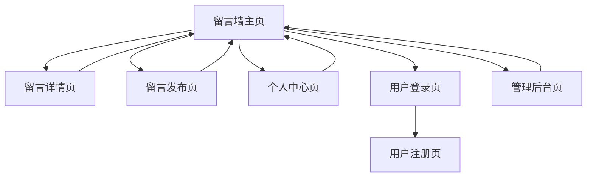

# Timeline Notebook 留言墙功能需求文档

## 1. 产品概述

为Timeline Notebook项目新增留言墙功能模块，提供用户互动交流平台，支持文字、图片发布，评论点赞互动，并具备完善的后台管理和内容审核机制。

该功能将丰富用户体验，增强社区互动性，为用户提供一个安全、友好的交流环境，同时为管理员提供高效的内容管理工具。

## 2. 核心功能

### 2.1 用户角色

| 角色 | 注册方式 | 核心权限 |
|------|----------|----------|
| 普通用户 | 用户名密码注册 | 发布留言、评论、点赞、查看个人中心 |
| 管理员 | 系统预设或升级 | 所有用户权限 + 留言管理、用户管理、内容审核 |

### 2.2 功能模块

留言墙功能包含以下核心页面：

1. **留言墙主页**：留言列表展示、发布入口、筛选排序功能
2. **留言发布页**：文字编辑、图片上传、内容预览、发布确认
3. **留言详情页**：留言详细内容、评论列表、点赞互动
4. **个人中心页**：用户信息、我的留言、互动记录
5. **管理后台页**：留言管理、用户管理、内容审核、数据统计

### 2.3 页面详情

| 页面名称 | 模块名称 | 功能描述 |
|----------|----------|----------|
| 留言墙主页 | 留言列表 | 展示所有留言，支持时间/热度排序，分页加载 |
| 留言墙主页 | 发布入口 | 快速发布按钮，跳转到发布页面 |
| 留言墙主页 | 筛选功能 | 按时间、热度、用户筛选留言 |
| 留言发布页 | 内容编辑 | 富文本编辑器，支持文字格式化 |
| 留言发布页 | 图片上传 | 支持多图上传，图片预览，格式限制 |
| 留言发布页 | 内容审核 | 实时关键词检测，违规内容提示 |
| 留言详情页 | 留言展示 | 完整留言内容，图片查看，用户信息 |
| 留言详情页 | 评论系统 | 评论发布、回复、嵌套显示 |
| 留言详情页 | 点赞功能 | 点赞/取消点赞，点赞数统计 |
| 个人中心页 | 用户信息 | 头像、昵称、注册时间、统计数据 |
| 个人中心页 | 我的留言 | 个人发布的留言列表，编辑删除 |
| 个人中心页 | 互动记录 | 点赞、评论历史记录 |
| 管理后台页 | 留言管理 | 留言列表、置顶、删除、修改、审核 |
| 管理后台页 | 用户管理 | 用户列表、权限管理、封禁解封 |
| 管理后台页 | 内容审核 | 关键词管理、举报处理、审核日志 |
| 管理后台页 | 数据统计 | 留言数量、用户活跃度、热门内容 |

## 3. 核心流程

### 普通用户流程
用户首先需要注册账号并登录，然后可以在留言墙主页浏览其他用户的留言，点击发布按钮创建新留言，支持添加文字和图片。用户可以对感兴趣的留言进行点赞和评论，也可以在个人中心查看自己的留言和互动记录。

### 管理员流程
管理员除了拥有普通用户的所有功能外，还可以进入管理后台对留言进行管理操作，包括置顶热门留言、删除违规内容、修改不当信息。管理员可以设置和维护关键词过滤规则，处理用户举报，查看系统数据统计。

## 4. 用户界面设计

### 4.1 设计风格

- **主色调**：#3498db（蓝色）、#2ecc71（绿色）
- **辅助色**：#95a5a6（灰色）、#e74c3c（红色警告）
- **按钮样式**：圆角设计，悬停效果，渐变背景
- **字体**：系统默认字体，标题16px，正文14px，说明12px
- **布局风格**：卡片式设计，响应式布局，顶部导航
- **图标风格**：线性图标，统一风格，适当使用emoji表情

### 4.2 页面设计概览

| 页面名称 | 模块名称 | UI元素 |
|----------|----------|--------|
| 留言墙主页 | 留言列表 | 卡片式布局，头像+用户名+时间，内容预览，点赞评论数，悬停效果 |
| 留言墙主页 | 发布入口 | 固定位置悬浮按钮，蓝色背景，加号图标，点击动画 |
| 留言墙主页 | 筛选功能 | 顶部标签页，时间/热度切换，搜索框，筛选图标 |
| 留言发布页 | 内容编辑 | 全屏编辑器，工具栏，字数统计，实时预览 |
| 留言发布页 | 图片上传 | 拖拽上传区域，缩略图预览，删除按钮，进度条 |
| 留言详情页 | 留言展示 | 大卡片布局，完整内容，图片轮播，用户信息栏 |
| 留言详情页 | 评论系统 | 嵌套评论，回复按钮，时间显示，分页加载 |
| 个人中心页 | 用户信息 | 头像上传，信息编辑，统计卡片，徽章展示 |
| 管理后台页 | 留言管理 | 表格布局，批量操作，状态标签，操作按钮组 |

### 4.3 响应式设计

采用移动优先的响应式设计，支持桌面端和移动端访问。移动端优化触摸交互，适配不同屏幕尺寸，确保在各种设备上都有良好的用户体验。